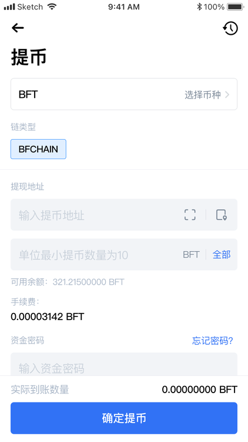

# Application example
    This article uses a simple development example of the exchange withdrawal function, including the preparation of the development environment and the deployment of BFMeta, so that developers can easily master how to develop their own DApp on the BFMeta network.

# Development Preparation
    The development example in this article uses TypeScript for development, in order to help developers get started quickly, some necessary tools need to be prepared before development.

#### 1.Nodejs v16+
- Select the version from Nodejs official website (https://nodejs.org/) to install
- View Nodejs version
node -v
v16.13.2

#### 2.TypeScript 4.6+
- Install ypescript
npm install -g typescript

- View Typescript version
tsc -v

#### 3.Vscode
- Download the latest version of Vscode from the official website (https://code.visualstudio.com/)

# The installation and deployment of nodes
    Developers can download the installation program of the node from the BFChain official website (https://developer.bfmeta.org), and start the local node after the installation.

# Concrete example
## Requirement statement

In mainstream exchanges, it is a common feature for users to recharge and withdraw cash.
It includes the following features：

- Import SDK
- Check account balance
- User withdrawal (transfer)

The functions are shown in the figure：



## The DB structure of the account

###Step1:Initialize SDK

- See the previous chapter of sdk import for details

```ts

import { bfmetaSDK } from "../bfmetaSDKInit";

export class BFMetaUtil {
    public bfmetaSDK: BFMetaSDK = bfmetaSDK;
    constructor() { 

    /**
    *   Get the latest block of the local node
    */
    async getLastBlock() {
        return this.bfmetaSDK.api.basic.getLastBlock();
    }

    /**
    *   Obtain account balance
    *   @param:address:account address
    *   @param:assetType:asset type
    */
    async getAddressBalance(address: string, assetType?: string) {
        if (!assetType) assetType = "BFM";
        const accountAsset = await this.bfmetaSDK.api.basic.getAccountLastTransaction({
            address: address,
            assetType: assetType
        })
        if (accountAsset && accountAsset.success === true) {
            return this.getAssetBalance(address, accountAsset.result.transactionInBlock)
        } else {
            return "0";
        }
    }

    async getAssetBalance(address: string, tr) {
        const assetChange = tr.transactionAssetChanges;
        if (assetChange && assetChange.length > 0) {
            const isSender = address === tr.transaction.senderId;
            const isRecipient = address === tr.transaction.recipientId;
            let assetType = "";
            if(tr.transaction && tr.transaction.storageKey === "assetType" && tr.transaction.storageKey){
                assetType = tr.transaction.storageKey
            };
    
            for(const change of assetChange){
                if((isSender && change.accountType ===0) || (isRecipient && change.accountType === 1)){
                    if(!assetType){
                        return change.assetBalance;
                    }
                    if(assetType !== "BFM" && change.assetTypes === 0){
                        return change.assetBalance;
                    }
                }
            }
        }
        return "0"
    }

    get bfmetaSDK() {
        return this.bfmetaSDK;
    }
}

```

###Step2: Initializes the data structure
In order to simplify the data model, in this example, we only use the two data models of Account and Transaction. Take MongoDB as an example.

- Account data model(Account)

```ts
import { Schema } from "mongoose"

const accountSchema = new Schema({
    accountId: { type: String, require: true },     // account ID
    address: { type: String, require: true },       // account address
    coin: { type: String, require: true },          // currency
    balance: { type: String, require: true }        // balance
});

export const account = mongoose.model("account", accountSchema)
```
- Transaction data model (Transaction)

```ts
const transactionSchema = new Schema({
    tranId: { type: String, require: true },         //  transaction ID
    amount: { type: Number, require: true },         //  transaction amount
    tranType: { type: String, require: true },       //  transaction type
    senderId: { type: String, require: true },       //  sender ID
    recipientId: { type: String, require: true },    //  receiver ID
    signature: { type: String, require: true }       //  transaction signature
});

export const transaction = mongoose.model("transaction", transactionSchema)
```

###Step3: Generate transaction
```ts
// The project side itself needs to have certain business code to ensure the normal operation of its own project
// In this sdk, only the query interface for transaction generation and broadcast, block and transaction is provided.
// Project side needs to use these transactions to expand its own business usage scenarios.
// For example, the withdrawal function is equivalent to the equity transfer transaction on the chain.

```
