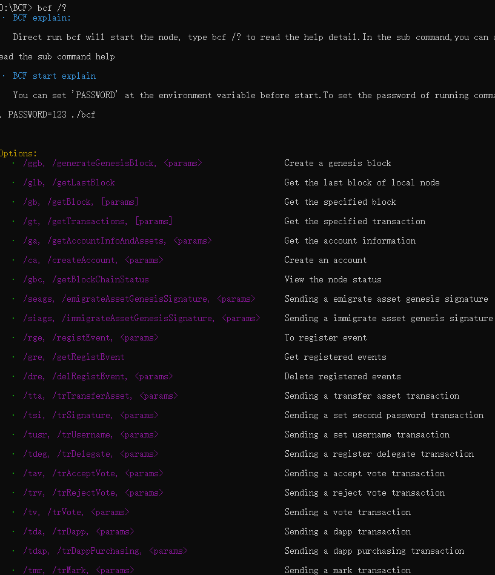
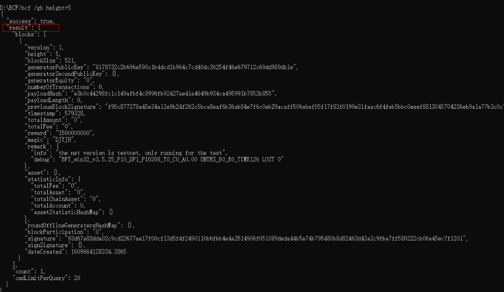
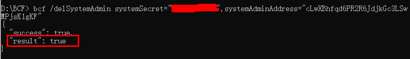

# Command line tool

## Get help information for command line tools

Enter the command "bcf /?" or "bcf /help" to get the BCF command line help description (under Linux, "bcf -h" or "bcf
"--help" is "bcf /?" or "bcf /help", the following uses Windows as an example), the detailed command list is as follows: 

| **Command abbreviation** | **Complete command** | **Interface command function description**             |
|--------------|--------------------------|----------------------------------|
| /h | /help | bcf command line tool usage help |
| /v | /version | View version information |
| /sp | /setpassword | Set command line execution password |
| /glb | /getLastblock | Get the latest block |
| /gb | /getBlock | Get the specified block |
| /gt | /getTransactions | Get the specified event |
| /ga | /getAccountInfoAndAssets | Get account information by address |
| /ca | /createAccount | Create Account |
| /gci | /getConfigInfo | View node parameter information |
| /gbc | /getBlockChainStatus | View node status |
| /tta | /trTransferAsset | Send equity transfer event |
| /tsi | /trSignature | Send set security password event |
| /tusr | /trUsername | Send address naming event |
| /tdeg | /trDelegate | Send registered forger event |
| /tav | /trAcceptVote | Send acceptance vote event |
| /trv | /trRejectVote | Send rejection vote event |
| /tv | /trVote | Send governance voting events |
| /tda | /trDapp | Send create DAPPID event |
| /tdap | /trDappPurchasing | Send DAPPID paid events |
| /tmr | /trMark | Send data storage event |
| /tia | /trIssueAsset | Send equity issue event |
| /tdya | /trDestoryAsset | Send event of destruction of equity |
| /ttea | /trToExchangeAsset | Send equity exchange event |
| /tbea | /trBeExchangeAsset | Send and receive equity exchange events |
| /ttesa | /trToExchangeSpecAsset | Send asset exchange event |
| /tbesa | /trBeExchangeSpecAsset | Send and receive asset exchange events |
| /tga | /trGiftAsset | Send equity gift event (red envelope event) |
| /tgra | /trGrabAsset | Send and receive rights gift event (red envelope grab event) |
| /ttra | /trTrustAsset | Send delegated equity event |
| /tsfa | /trSignForAsset | Send and receive entrusted equity event |
| /tln | /trLocationName | Send registration and cancellation of location name system events |
| /tslm | /trSetLnsManager | Send set name system administrator event |
| /tslns | /trSetLnsRecordValue | Send set bit name system resolution value event |
| /mmi | /miningMachineInfo | Node Information |
| /sfc | /safetyClose | Safely close the node |
| /ssk | /setSystemKey | Set node password |
| /vfs | /verifySystemKey | Verify node password |
| /asa | /addSystemAdmin | Add node administrator |
| /ssd | /setSystemDelegate | Set node delegate |
| /ssd | /getSystemDelegate | Get Node Trustee |
| /gsa | /getSystemAdmin | Get Node Administrator |
| /ssc | /setSystemConfig | Set node configuration information |
| /grs | /getRuntimeState | Set node state (real-time information) |
| /gsm | /getSystemMonitor | Get node access statistics |
| /glt | /getSystemLoggerType | Get the node running log type |
| /gll | /getSystemLoggerList | Get a list of node running logs |
| /gld | /getSystemLoggerDetail | Get the content of the node running log |
| /gsci | /getSystemConfigInfo | Get node configuration information |
| /gea | /getEmailAddress | Get the node email address |
| /sea | /setEmailAddress | Set node email address |
| /vsa | /verifySystemAdmin | Verify Node Administrator |
| /vss | /verifySystemSecret | Verify node trustee through node private key |
| /swl | /setSystemWhiteList | Set node whitelist |
| /gwl | /getSystemWhiteList | Get the node whitelist |
| /dwl | /delSystemWhiteList | Delete node whitelist |
| /gpn | /getProcessNetwork | Get node process network information |
| /gpc | /getProcessCPU | Get node process |
| /gpm | /getProcessMemory | Get node process memory information |
| /dsa | /delSystemAdmin | Delete node administrator |
| /ess | /systemStatus | Send node status regularly |
| /esp | /systemProcess | Send nodes regularly                     |

Description:

1. For a single command: you can enter "/?" to view the details of the command help information, such as "bcf /glb
    /?" View the help information details of the command to get the latest block;

2. For command combination: if you need to view the help information of multiple commands, you can directly enter multiple commands and add "/?"
    For example "bcf /glb /gb /?"

-Note: Without entering "/?", only /sp(/setpassword) can be combined with other commands,
    For example, bcf /glb /sp 123 means to set the command line execution password to 123 and obtain the latest altitude. in the case of
    The combination of bcf /glb /gb will be illegal.

1. The help information is shown in the figure below

1. Query the help information of a command

    Take "/gb" as an example. Enter "bcf /gb /?" to get help information

## Command line call example

According to the help information in the above figure, you can enter "bcf /gb height=5" to query the block according to the height, and the query height is 5
The block is returned as follows:

## Return parameter description

The return parameter contains two parts:

1. Call success/failure flag:

    Return the first parameter success in the parameters, indicating whether the result of the call is success or failure.

    1. If the result of the call is successful, success:true is returned

1. If the result of the call fails, success: false is returned, and an error message is returned at the same time:

1. Implementation results

    The second parameter in the return parameter is the execution result. There are two types of command lines: query command lines and setting command lines:

    1. When the command to execute the query operation is executed successfully, the return result is as follows:

1. When the command to execute the configuration operation is executed successfully, the return result is generally:

