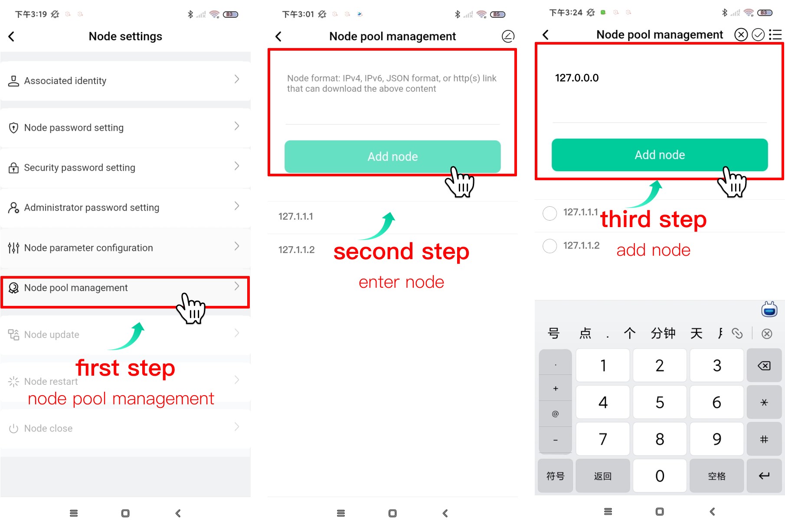

## Introduction

This manual describes how to manage all of your nodes through the node Manager. Here, you'll learn how to add, remove and manage node trustees, and configure node parameters, etc.

## Install the node manager

Download the node manager app installation package from BFMeta developer community https://developer.bfmeta.org/. After downloading, select the application package and install it according to the steps. After successful installation, skip the boot page to enter.

## Enter the node manager

After the installation, you can directly enter the node manager without logging in.

## Node management

### Adding Nodes

Click the<Add External Node>button, and then click the<Manually Configure Node>button at the bottom of the Add Node page, fill in the node IP in the pop-up window, and select the node management identity.

- If the identity you select is the owner, verifying the node password is required.
After the verification succeeds, you can check the information related to the node and determine whether the node is bound to a trustee.

- If a trustee has been bound to the node, you need to fill in the trustee key to add the node.
- If no trustee has been bound, the node can be added directly. Nodes can also be added after the trustee is bound in this process.
- If the identity you select is the administrator, check whether the node has been set the <Administrator Password Settings>. If the administrator password has been set, the node can be added after the password is successfully verified. Otherwise, the node cannot be added.
   

### Delete node

Select the desired node to delete, press and hold to slide to the left and the <Delete> button appears, click the button to delete.

### View node details

Select the node you want to check and click it to enter the node details. You can see the following information:

- Node CPU usage
- The number of nodes that have participated in the consensus (number of blocks)
- Network bandwidth usage
- HDD usage
- memory usage
- Receive the total amount of the transaction
- Receive transaction total on-chain fee
- Network node traffic consumption: request node IP, number of requests, number of request failures, request data size
- List of created blocks: block creation time, number of rewarded rights and interests obtained, block height, block size, transaction volume of this block
- Node operation log: node operation log classification, log quantity, log size, log generation time and view log details.
  

### Trustee Binding

If you want to bind trustee, click the icon on the top right of the node information page to enter the node setting page, and then click<Without binding truste>to conduct management.

- If the node has been bound to a trustee, the address of the bound trustee will be displayed.
- If the node is not bound to a trustee, you can enter the trustee key to add the trustee.
   

### Trustee Security Password Settings

When you need to manage node password, click the icon on the top right of the node details page to enter the node settings page, and then select<Security Password Settings>to conduct management. Enter the identity private key verification associated with the node, and then enter the private key of the associated identity, then the security password of the trustee address can be set.

* Note: The node password can only be set when the role is the mine owner. *

### Node Password Settings

When you want to manage node password, click the icon on the top right of the node details page to enter the node settings page, and then select “node password setting”.  Enter the old password of the node, and then enter the same new password twice, the node password can be modified.
* Note: The node password can only be set when the role is the miner. 

### Node administrator password setting

When the role that node log in is miner, node administrator password can be set. After the node administrator password is verified, the administrator can help manage the node.
Click the icon on the top right of the node details page to enter the node settings page. Click <Administrator Password Settings>  to conduct management.

### Node parameter configuration

When users need to modify node parameters, click <Node parameter setting>to enter the node parameter management page. The following is the parameters node can be configured.

1. Node launch configuration: node must enable blocking, or the equity cannot be obtained. Enable key point retention rounds, which means that the blockchain will create a key checkpoint at the end of each round, and the data can be quickly started or rolled back later according to the checkpoint. This configuration determines the number of key checkpoint retention.
2. Access configuration:
Set the upper limit of visits in node interface and traffic.
3. Network configuration:
    Whether to enable grpc.
4. Log configuration:
    Set the level of log storage, maximum size of single log file, Maximum number of log storage partitions, clearing cycle, etc.
5. Event configuration:
    Set the fee related to event, the number of node transactions, the maximum number of events, etc. You can also set the requisition for voters during automatic voting.
6. Disk configuration: set the cycle of cleaning the disk and the critical value of disk storage space.
7. Process configuration: set the maximum number of relevant concurrency.
8. Port configuration: view the details of port configuration.
    

### Node pool management

Click the <Node Pool Management> on the node settings page to set the whitelist of connected nodes.

Supplementary note: Obtaining whitelist nodes

Step 1: Click the link below：
[BFM PC Node Program Information](https://github.com/BioforestChain/BCF-Infomation/tree/main/)

Step 2: Find the node program list on the page and click any data in the available IP address list to open a new page and view the IP address information of the node.

Step 3: Fill the node information into the mobile terminal to add the whitelist nodes.

### Restart the node

If you need to restart the node, click <Restart node> on the node settings page, and then click <confirm>button in the prompt box to restart the node. It should be noted that blocking and voting will be suspended in the process of restarting.

### Node update

When you need to update node, click <Node update> on the node setting page. The system will detect the update package. If there is an update package, it will be displayed directly. If the update package has not downloaded yet, click the <Download now>button, and then click the  <Update now> button after downloading. Next, please wait patiently for the update. You can exit the page during the updating and re-enter the system after the update has been completed.
Note:
* Nodes will stop voting and blocking in the process of updating. Please select the appropriate time to update.
Please rebind the trustee after the update has been completed, or the block cannot be synchronized.

### Node shutdown

When you need to close node, click  <Node Shutdown>on the node settings page, and click <Confirm> the pop-up dialog box to close the node.

### Application Language Settings

Click the <Settings> button on the top right of the node list. Click <Language selection>to select language. After selecting the language you want and returning, restart can change the language.

### Application update

Click the <Settings>button on the top right of thr node list to enter Settings page. Click Version Management. If a new version is displayed, click 《version management>, and follow the prompts to download the installation package, and then follow the prompts to update the application.

## Summary

Blockchain technology is constantly developing and improving, and the functions of our node manager is also continuously improving. This operation manual is the version released on the first official release date. It will be updated and revised at any time in the future. Please pay attention to the official platform of BFMeta developers for the latest information.
