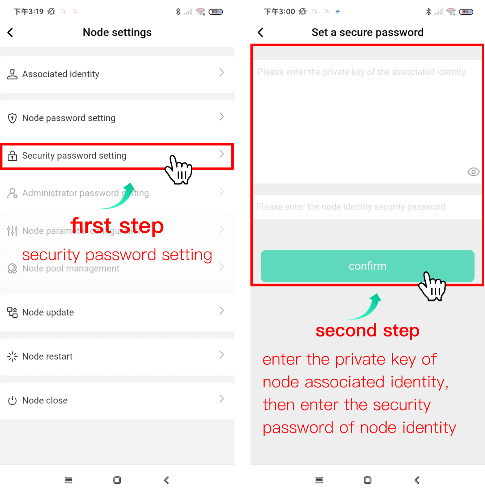
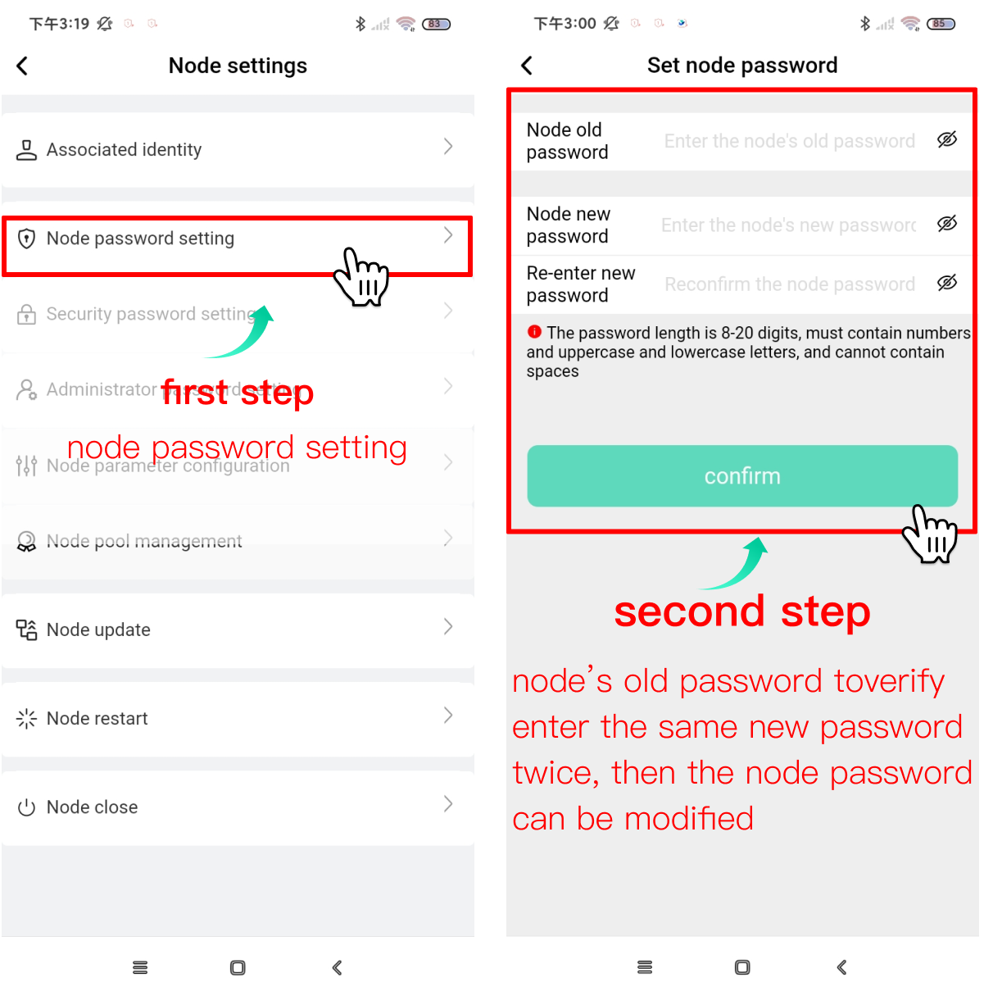
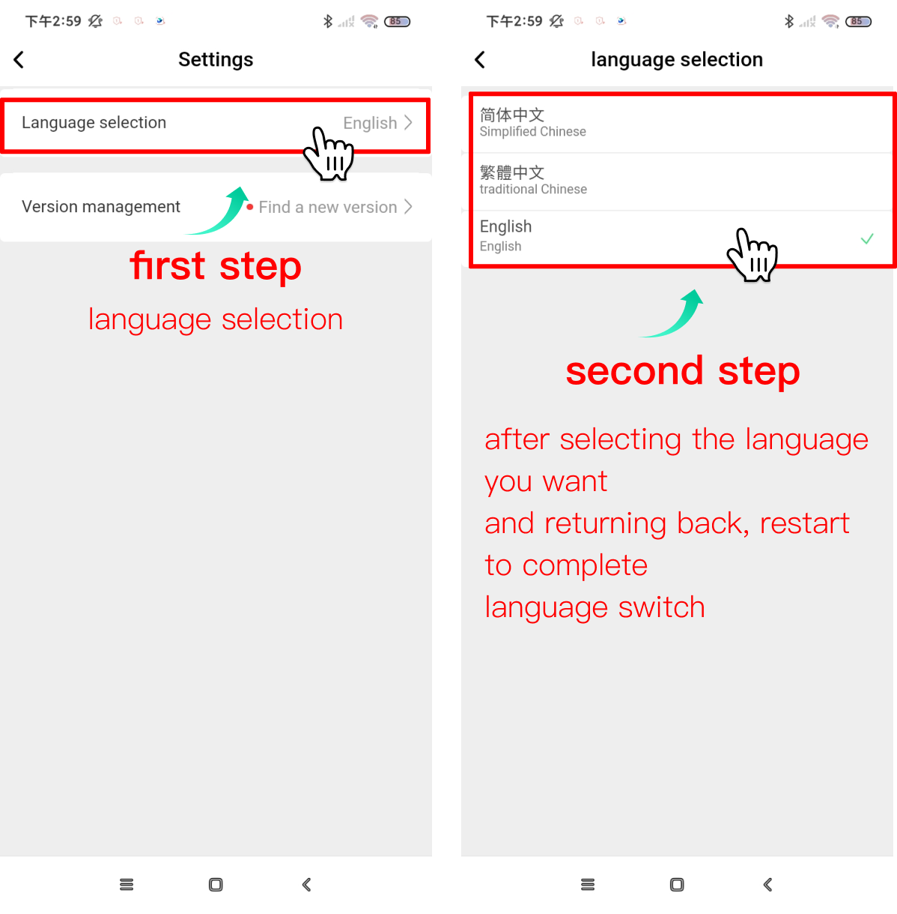

## Introduction

This operation manual mainly describes how to manage all your nodes in the BFMeta node manager application. Here, you will learn how to add, delete, manage node trustees and configure node-related parameters, etc.

## Install the node manager

Download the node manager application installation package from the BFMeta developer community https://developer.bfmeta.org. After the download is complete, select the application package and follow the steps to install it. After the installation is successful, skip the boot page and enter.

## Enter the node manager

After downloading and installing, you can directly enter the BFMeta node manager without logging in

## Node management

### Adding Nodes

Users can manually add nodes. When adding, you need to verify the node password. At the same time, if the node is bound to the trustee, the trustee key needs to be injected. If the node is not bound to the trustee, the trustee information can be injected after adding the node.

Click the <Add external node button>, click the bottom <Manual configuration node> button on the add node page, fill in the node IP in the pop-up window, and select the node management identity.

- If the identity is not the host, you need to verify the node password.
   After the verification is passed, you can view the relevant information of the node and determine whether the node has been bound to the trustee.
- If the trustee has been bound, you need to fill in the trustee's secret key to complete the node addition.
- If no trustee is bound, you can add it yourself. Node addition can also be done after adding trustees in this process.
- If you select the identity as an administrator, you need to judge whether the node has set <administrator password setting>, - if the administrator password is verified successfully, the addition is successful, otherwise the addition fails.
   

### Delete node

Select the desired node to delete, press and hold to slide to the left and the <Delete> button appears, click the button to delete.

### View node details

Select the node to be viewed, and click the node to enter the node details. You can see the following information:

- Node CPU usage
- The number of nodes that have participated in the consensus (number of blocks)
- Network bandwidth usage
- HDD usage
- memory usage
- Receive the total amount of the transaction
- Receive transaction total on-chain fee
- Network node traffic consumption: request node IP, number of requests, number of request failures, request data size
- List of created blocks: block creation time, number of rewarded rights and interests obtained, block height, block size, transaction volume of this block
- Node operation log: node operation log classification, log quantity, log size, log generation time and view log details.
  

### Trustee Binding

When you need to bind a trustee, click the icon at the top right of the node details page to enter the node settings page, and select <Bind Trustee> to manage.

- If the node has been bound to a trustee, the address of the bound trustee will be displayed.
- If the node is not bound to a trustee, you can enter the trustee key to add the trustee.
   

### Trustee Security Password Settings

When you need to manage node passwords, click the icon at the top right of the node details page to enter the node settings page, and select <Security Password Settings> to manage. Enter the identity private key associated with the node for verification, and then enter the node identity security password to set the trustee's address security password.

*Note: The node password can only be set when the role is the mine owner. *

### Node Password Settings

When you need to manage node passwords, click the icon at the top right of the node details page to enter the node settings page, and select <Node Password Settings> to manage. Enter the old password verification of the node, and enter the same new password twice. Then the node password can be modified.
*Note: The node password can only be set when the role is the mine owner. *

### Node administrator password setting

When the role of the node login is the mine owner, the node administrator password can be set. Only by verifying that the node administrator password is passed, the administrator can assist in managing the node.
Click the icon at the top right of the node details page to enter the node settings page, and click <Administrator Password Settings> for management.

### Node parameter configuration

When the user needs to modify the node parameters, click the <Node Parameter Configuration> button on the node setting page to enter the node parameter management page. The following are the configurable parameters of the node.

1. Node startup configuration: The node must enable block building, otherwise it will not be able to obtain benefits. The key point retention round starts, which means: the blockchain will create a key checkpoint at the end of each round, and then the data can be quickly started or rolled back according to the checkpoint. This configuration determines the number of key checkpoints retained.
2. Access configuration:
    Set the upper limit of the number of visits, the upper limit of traffic, etc. within the node interface cycle.
3. Network configuration:
    Whether to enable grpc.
4. Log configuration:
    Set the level of log storage, the upper limit size of a single log file, the upper limit of log storage splits, the cleaning cycle, etc.
5. Event configuration:
    Set the relevant handling fee of the event, the number of node transactions, the upper limit of the number of events, etc. You can also set the selection criteria for voters during automatic voting.
6. Disk configuration: set the cycle of cleaning the disk and the critical value of disk storage space.
7. Process configuration: set the upper limit of the concurrent number of related processes.
8. Port configuration: Check the port configuration.
    

### Node pool management

Click <Node Pool Management> from the node setting page to set the whitelist of connected nodes.

### Notification email settings

Click <Mailbox Configuration> on the node settings page to configure the mailbox to receive email reminders from the system such as insufficient memory and CPU usage exceeding the limit.

### Restart the node

When you need to restart the node, click <Restart Node> on the node setting page, and select the <Confirm> button in the prompt box to restart. In particular, it should be noted that block making and voting will be suspended during the restart process.

### Node update

When you need to upgrade a node, click <Node Update> on the node settings page, the system will detect the upgrade package, and if there is an upgradeable package, it will be displayed directly. If the upgrade package has not been downloaded, click the <Download Now> button on the page, and then click the <Immediate> Upgrade button on the page after downloading. Next, please wait patiently for the upgrade, and you can exit the page during the upgrade process. After the upgrade is complete, re-enter the system.

*Note: Nodes will stop voting and block building during the upgrade process. Please choose the right time to upgrade.
After the upgrade is successful, please re-bind the trustee, otherwise the block cannot be synchronized. *

### Node shutdown

When you need to shut down the node, click <Node Shutdown> on the node setting page, and click the <Confirm> button on the pop-up prompt page to shut down the node.

### Application Language Settings

Click the [Settings] button in the upper right corner of the node list to enter the setting page. Click [Language Settings] to enter the language selection page, select the desired language and return, then restart to complete the language switching.

### Application update

Click the [Settings] button in the upper right corner of the node list to enter the setting page. Click [Version Management] and if there is a new version, follow the prompts to download the installation package, and then follow the prompts to install to update the application.

## Summary

Blockchain technology is constantly developing and improving, and our node manager function is also being continuously optimized. This operation manual is the first official release date, and it will be updated and revised at any time in the future. Please pay attention to the BFMeta developer official platform to obtain the latest information.
