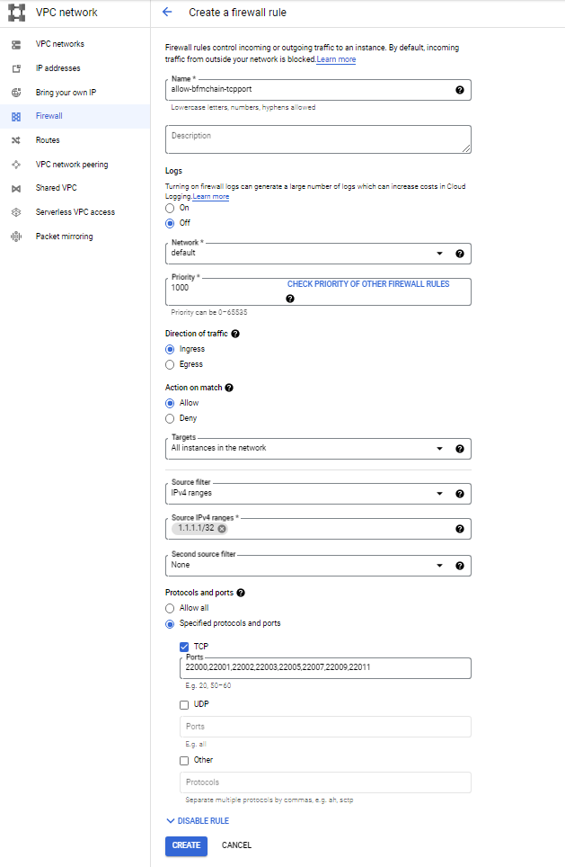
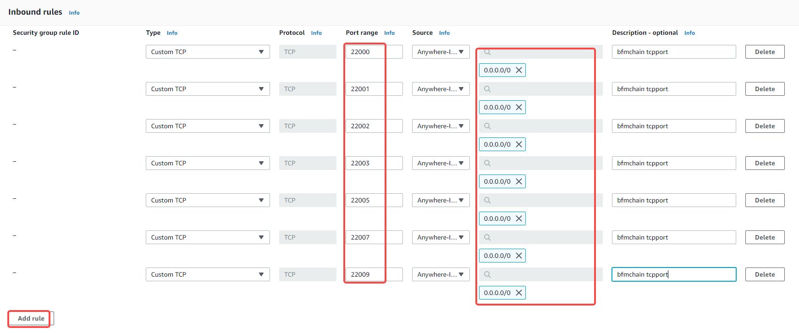

# Node deployment

## Prepare

- Disable SELinux

   ```
   sed -i's/SELINUX=enforcing/SELINUX=disabled/g' /etc/selinux/config
    
   ```

- Install the software package
  
   ```
   yum install -y zip unzip ntp epel-release

   ```
  
- Synchronize network time

   ```
   ntpdate -u cn.pool.ntp.org

   #Add a scheduled task to automatically synchronize the time at 3 o'clock in the morning every day
   echo "0 3 * * * /usr/sbin/ntpdate -u cn.pool.ntp.org ;/usr/sbin/hwclock -w" >>/var/spool/cron/root
   ```
  
- Install related dependencies

  ```
  rpm -ivh https://mirrors.aliyun.com/centos-vault/8.0.1905/BaseOS/x86_64/os/Packages/crypto-policies-20181217-6.git9a35207.el8.noarch.rpm
  rpm -ivh --replacefiles https://mirrors.aliyun.com/centos-vault/8.1.1911/BaseOS/x86_64/os/Packages/openssl-libs-1.1.1c-2.el8_1.1.x86_64.rpm
  rpm -ivh --replacefiles https://mirrors.aliyun.com/centos-vault/8.1.1911/BaseOS/x86_64/os/Packages/openssl-1.1.1c-2.el8_1.1.x86_64.rpm
  rpm -ivh https://mirrors.aliyun.com/centos-vault/7.0.1406/os/x86_64/Packages/libevent-2.0.21-4.el7.x86_64.rpm
  yum install -y supervisor
  
  ```
- Adjust the maximum number of files that users can use:

  ```
  echo -ne "
    * soft nofile 65536
    * hard nofile 65536
  " >> /etc/security/limits.conf
  ```

  

- Kernel parameter optimization

  ```
  echo -ne "
    net.ipv4.tcp_max_tw_buckets=10000
    net.ipv4.tcp_sack=1
    net.ipv4.tcp_window_scaling=1
    net.ipv4.tcp_rmem=4096 87380 4194304
    net.ipv4.tcp_wmem=4096 16384 4194304
    net.ipv4.tcp_max_syn_backlog=65536
    net.core.netdev_max_backlog=65536
    net.core.somaxconn=32768
    net.core.wmem_default=8388608
    net.core.rmem_default=8388608
    net.core.wmem_max=16777216
    net.core.rmem_max=16777216
    net.ipv4.tcp_synack_retries=2
    net.ipv4.tcp_syn_retries=2
    net.ipv4.tcp_tw_recycle=1
    net.ipv4.tcp_tw_reuse=1
    net.ipv4.tcp_keepalive_time=1200
    net.ipv4.tcp_mem=94500000 915000000 927000000
    net.ipv4.tcp_max_orphans=3276800
    net.ipv4.ip_local_port_range=9000 65000
    vm.swappiness=0
    net.ipv4.tcp_fin_timeout=15
    fs.file-max=1048576
  " >> /etc/sysctl.conf
  
  ```

 

- Use jemalloc to optimize memory usage
   In order to optimize the memory usage, you can use jemalloc instead of the system glibc malloc, the method is as follows:
   centos7 (you need to restart the server after configuration):

  ```
  rpm -ivh https://cbs.centos.org/kojifiles/packages/jemalloc/3.6.0/8.el7.centos/x86_64/jemalloc-3.6.0-8.el7.centos.x86_64.rpm
  rpm -ivh https://cbs.centos.org/kojifiles/packages/jemalloc/3.6.0/8.el7.centos/x86_64/jemalloc-devel-3.6.0-8.el7.centos.x86_64.rpm
  echo "/usr/lib64/libjemalloc.so" >> /etc/ld.so.preload
  
  ```

  

 

## Public chain node deployment

### Node program installation and configuration

In order to ensure that you can run the BFMeta PC node program-BCF smoothly, we recommend that you use the following configuration equipment:

   CPU: 16 cores (main frequency 3.0G+)

   Memory: 16G

   Hard Disk: SSD 1T or above

   System: CentOS 7.*


- The installation and configuration steps of the node program and the upgrade service program are as follows:

1. Create a directory for BFMeta

    ```
    mkdir -p /data
    ```

   

2. Upload the BFMeta.zip file (the compressed file contains the BFMeta program and the upgrade service program) and unzip it to the /data directory

   ```
   unzip -o -q /data/release/BFMeta.zip -d /data/
   
   ```

   

3. Grant executable permissions to the file

   ```
   chmod u+x /data/BFMeta/bcf
   chmod u+x /data/BFMeta/mongoComponents/linux/mongo*
   chmod u+x /data/BFMeta/turnserver/bin/turnserver
   chmod u+x /data/upgrade/mongoComponents/linux/mongo*
   chmod u+x /data/upgrade/upgrade
   echo "export BCF_HOME=/data/BFMeta"  >> /etc/profile
   #生效环境变量
   source  /etc/profile 
   ```

   

4. Configure supervisor (manage BFMeta running in the background and upgrade service process)

   ```
   echo -ne "
   	[program:bcf]	
   	command=/data/BFMeta/bcf  ; 
   	directory=/data/BFMeta
   	autostart=true    ; 
   	user=root      ;
   	autorestart=unexpected   ;
   	exitcode=0,2   ;
   	startretries=3    ;
   	priority=999     ;
   	redirect_stderr=true ;
   	stdout_logfile_maxbytes=50MB  ;
   	stdout_logfile_backups = 20  ;
   	stdout_logfile=/data/BFMeta/logs/bcf.log    ;
   	stopasgroup=true   ;
   " >> /etc/supervisord.d/bcf.ini
   
   echo -ne "
   	[program:upgrade]
   	command=/data/upgrade/upgrade  ; 
   	directory=/data/upgrade
   	autostart=true       ; 
   	user=root           ;
   	autorestart=unexpected    ;
   	exitcode=0,2    ;
   	startretries=3       ;
   	priority=999         ;
   	redirect_stderr=true ;
   	stdout_logfile_maxbytes=50MB  ;
   	stdout_logfile_backups = 20   ;
   	stdout_logfile=/data/upgrade/logs/console.log      ;
   	stopasgroup=true     ;
   " >> /etc/supervisord.d/upgrade.ini
   ```

### Firewall configuration

1. System firewall policy
   
   - firewalld
   
   ```
   Allow all external ip access:
    firewall-cmd --add-port=9000/tcp --add-port=9001/tcp --add-port=9002/tcp --add-port=9003/tcp --add-port=9005/tcp - add-port=9007/tcp --add-port=9009/tcp --add-port=9011/tcp --permanent
   
    Allow external ip (such as 1.1.1.1/32) to access:
   firewall-cmd --permanent --add-rich-rule="rule family="ipv4" source address="1.1.1.1/32" port port="9000" protocol="tcp" accept"
   firewall-cmd --permanent --add-rich-rule="rule family="ipv4" source address="1.1.1.1/32" port port="9001" protocol="tcp" accept"
   firewall-cmd --permanent --add-rich-rule="rule family="ipv4" source address="1.1.1.1/32" port port="9002" protocol="tcp" accept"
   firewall-cmd --permanent --add-rich-rule="rule family="ipv4" source address="1.1.1.1/32" port port="9003" protocol="tcp" accept"
   firewall-cmd --permanent --add-rich-rule="rule family="ipv4" source address="1.1.1.1/32" port port="9005" protocol="tcp" accept"
   firewall-cmd --permanent --add-rich-rule="rule family="ipv4" source address="1.1.1.1/32" port port="9007" protocol="tcp" accept"
   firewall-cmd --permanent --add-rich-rule="rule family="ipv4" source address="1.1.1.1/32" port port="9009" protocol="tcp" accept"
   firewall-cmd --permanent --add-rich-rule="rule family="ipv4" source address="1.1.1.1/32" port port="9011" protocol="tcp" accept"
   
   ```
   
   iptable
   
   ```
   Allow all external ip access:
    iptables -A INPUT -p tcp -m multiport --dport 9000:9003,9005,9007,9009,9011 -m state --state NEW,ESTABLISHED -j ACCEPT
   
   Allow external ip (such as 1.1.1.1/32) to access:
   iptables -A INPUT -p tcp -m multiport --dport 9000:9003,9005,9007,9009,9011 -m state --state NEW,ESTABLISHED -s 1.1.1.1/32  -j ACCEPT
   
   ```
2. Cloud platform fire protection strategy
   The node program is deployed on the cloud server, and the firewall inbound rules need to be opened according to the cloud service provider's operating document.

   - Google Cloud:

     ```
     1. Go to the "Firewall" (Network---VPC Network--Firewall) page in the Google Cloud Console.
     2. Click Create firewall rule.
     3. Enter the name of the firewall rule. The name must be unique in the project.
     4. Specify the network to implement firewall rules.
     5. Specify the priority of the rule.
     6. Select inbound as the flow direction.
     7. For the operation performed on the matching item, select Allow.
     8. For the target, perform one of the following operations:
     If you want to allow traffic from the BFMeta node instance to all clients in the network, please select all instances in the network.
     If you want to allow traffic from a specific client of the BFMeta node instance, select the specified target tag. Enter the instance name of the client in the target tag.
     9. Keep the default value of the IP address range of the source filter condition.
     10. For the source IP address range, enter the IP address range of the BFMeta node instance to be allowed as the source of access.
     You can enter 0.0.0.0/0 to allow all ip address access traffic to pass, or you can enter a specific IP address to restrict access to only that ip address (the CIDR notation must be used).
     11. Keep the default value of none for the secondary source filter condition.
     12. For the protocol and port, please select the specified protocol and port, and then:
     Check the tcp checkbox and enter 9000,9001,9002,9003,9005,9007,9009,9011 in the associated field.
     13. Choose Create.
     ```

     a) The open ports of all backend cloud servers allow all ip addresses to access:
     

     b) The open ports of all the back-end cloud servers allow access with characteristic ip addresses (such as 1.1.1.1):
     

     c) The open port of the cloud server with a specific back-end tag (such as BFMeta node) allows all ip addresses to access:
     

     d) The open port of the cloud server with a specific back-end tag (such as bfchainnode) allows access to the characteristic ip address (such as 1.1.1.1):

     
     

   

   

   - AWS:

     1. Click on the instance details that need to be configured "Security"-"Security Group":
        

     2. Then click "Edit Security Group Rules" in the pop-up security group:
        

     3. Add inbound rules:

        

     

   - Ali Cloud:

     1. Log in to the ECS cloud server console
        If you can't see the ECS instance, you can switch the geographic search to find the target instance that needs to be operated.

     2. In the instance list, click "More"-"Network and Security Group"-"Security Group Configuration"
        

     3. Open the security group configuration interface and click "Configure Rules"
        

     4. Security group access rule configuration (manually add rules)
        The access rules in the security group rules have two aspects, namely the inbound direction and the outbound direction. The inbound direction refers to the direction in which users access the server, and the outbound direction refers to the outbound access of the cloud server, which is generally not restricted.

        

   

   
   
   
### Start the service

1. Start BFMeta node program-BCF

   ```
   systemctl enable supervisord
   systemctl start supervisord
   
   ```


## Private chain node deployment

### environment

|       | Configuration                                                  | IP           |
| ----- | ----------------------------------------------------- | ------------ |
| Node1 | CPU: 16 cores Memory: 32G Bandwidth: 1G SSD: 1T System: centos 7.8 | 172.30.56.61 |
| Node2 | CPU: 16 cores Memory: 32G Bandwidth: 1G SSD: 1T System: centos 7.8 | 172.30.56.62 |
| Node3 | CPU: 16 cores Memory: 32G Bandwidth: 1G SSD: 1T System: centos 7.8 | 172.30.56.63 |


### Node program installation and configuration

> Please make sure that your device has installed the appropriate dependent environment.

1. Create bfchain directory

   ```
   mkdir -p /data/BFMeta/
   ```

2. Download the release version to obtain the complete bfchain installation package (BFMeta.zip).
   
3. Unzip BFMeta.zip to the /data/BFMeta directory

   ```
   unzip -o -q /data/release/BFMeta.zip -d /data/BFMeta
   ```

4. Grant executable permissions to the file

   ```
   chmod u+x /data/BFMeta/bcf
   chmod u+x /data/BFMeta/mongoComponents/linux/mongo*
   chmod u+x /data/BFMeta/turnserver/bin/turnserver
   echo "export BCF_HOME=/data/BFMeta" >> /etc/profile
   #Effective environment variables
   source /etc/profile
   ```

5. Configuration file

   - Download genesis block
      Purchase the genesis block from the bfchain team and put the files in the /data/BFMeta/genesisInfos directory
     
   - Modify the configuration file (/data/BFMeta/conf/base-config.json)
     
      Configure the externally introduced genesis block isGenesisInfoProvideExternally to true
     ​ Configure the official network or test network bnid as b or c
     ​ Configure the imported genesis chain chain name chainName
     ​ Configure the blockchain asset name chainAssetType of the imported genesis block
     ​ Configure the magic chainMagic of the imported genesis block
     
   - Configure node IP
     Modify the peers field in the configuration file /data/BFMeta/conf/bft-config-mainnet.json and add the ip of the initial connection
     
      
     
   
6. Configure supervisor (manage the bfchain process running in the background)

   ```
   echo -ne "
   [program:bcf]
   command=/data/BFMeta/bcf;
   directory=/data/BFMeta
   autostart=true;
   user=root;
   autorestart=unexpected;
   exitcode=0,2;
   startretries=3;
   priority=999;
   redirect_stderr=true;
   stdout_logfile_maxbytes=50MB;
   stdout_logfile_backups = 20;
   stdout_logfile=/data/BFMeta/logs/bcf.log;
   stopasgroup=true;
   ">> /etc/supervisord.d/bcf.ini
   ```


### Firewall configuration

1. System firewall strategy (only 3 nodes are open for interconnection)

   FIREWALLD:

   ```
   firewall-cmd --permanent --add-rich-rule="rule family="ipv4" source address="172.30.56.61" port port="9000" protocol="tcp" accept"
   firewall-cmd --permanent --add-rich-rule="rule family="ipv4" source address="172.30.56.61" port port="9001" protocol="tcp" accept"
   firewall-cmd --permanent --add-rich-rule="rule family="ipv4" source address="172.30.56.61" port port="9002" protocol="tcp" accept"
   firewall-cmd --permanent --add-rich-rule="rule family="ipv4" source address="172.30.56.61" port port="9003" protocol="tcp" accept"
   firewall-cmd --permanent --add-rich-rule="rule family="ipv4" source address="172.30.56.61" port port="9005" protocol="tcp" accept"
   firewall-cmd --permanent --add-rich-rule="rule family="ipv4" source address="172.30.56.61" port port="9007" protocol="tcp" accept"
   firewall-cmd --permanent --add-rich-rule="rule family="ipv4" source address="172.30.56.61" port port="9009" protocol="tcp" accept"
   firewall-cmd --permanent --add-rich-rule="rule family="ipv4" source address="172.30.56.61" port port="9011" protocol="tcp" accept"
   firewall-cmd --permanent --add-rich-rule="rule family="ipv4" source address="172.30.56.62" port port="9000" protocol="tcp" accept"
   firewall-cmd --permanent --add-rich-rule="rule family="ipv4" source address="172.30.56.62" port port="9001" protocol="tcp" accept"
   firewall-cmd --permanent --add-rich-rule="rule family="ipv4" source address="172.30.56.62" port port="9002" protocol="tcp" accept"
   firewall-cmd --permanent --add-rich-rule="rule family="ipv4" source address="172.30.56.62" port port="9003" protocol="tcp" accept"
   firewall-cmd --permanent --add-rich-rule="rule family="ipv4" source address="172.30.56.62" port port="9005" protocol="tcp" accept"
   firewall-cmd --permanent --add-rich-rule="rule family="ipv4" source address="172.30.56.62" port port="9007" protocol="tcp" accept"
   firewall-cmd --permanent --add-rich-rule="rule family="ipv4" source address="172.30.56.62" port port="9009" protocol="tcp" accept"
   firewall-cmd --permanent --add-rich-rule="rule family="ipv4" source address="172.30.56.62" port port="9011" protocol="tcp" accept"
   firewall-cmd --permanent --add-rich-rule="rule family="ipv4" source address="172.30.56.63" port port="9000" protocol="tcp" accept"
   firewall-cmd --permanent --add-rich-rule="rule family="ipv4" source address="172.30.56.63" port port="9001" protocol="tcp" accept"
   firewall-cmd --permanent --add-rich-rule="rule family="ipv4" source address="172.30.56.63" port port="9002" protocol="tcp" accept"
   firewall-cmd --permanent --add-rich-rule="rule family="ipv4" source address="172.30.56.63" port port="9003" protocol="tcp" accept"
   firewall-cmd --permanent --add-rich-rule="rule family="ipv4" source address="172.30.56.63" port port="9005" protocol="tcp" accept"
   firewall-cmd --permanent --add-rich-rule="rule family="ipv4" source address="172.30.56.63" port port="9007" protocol="tcp" accept"
   firewall-cmd --permanent --add-rich-rule="rule family="ipv4" source address="172.30.56.63" port port="9009" protocol="tcp" accept"
   firewall-cmd --permanent --add-rich-rule="rule family="ipv4" source address="172.30.56.63" port port="9011" protocol="tcp" accept"
   
   ```

   iptables:

   ```
   iptables -A INPUT -p tcp -m multiport --dport 9000:9003,9005,9007,9009,9011 -m state --state NEW,ESTABLISHED -s 172.30.56.61,172.30.56.62,172.30.56.63  -j ACCEPT
   ```


### Start the service

1. Start BFMeta node program-BCF

   ```
   systemctl enable supervisord
   systemctl start supervisord 
   
   ```