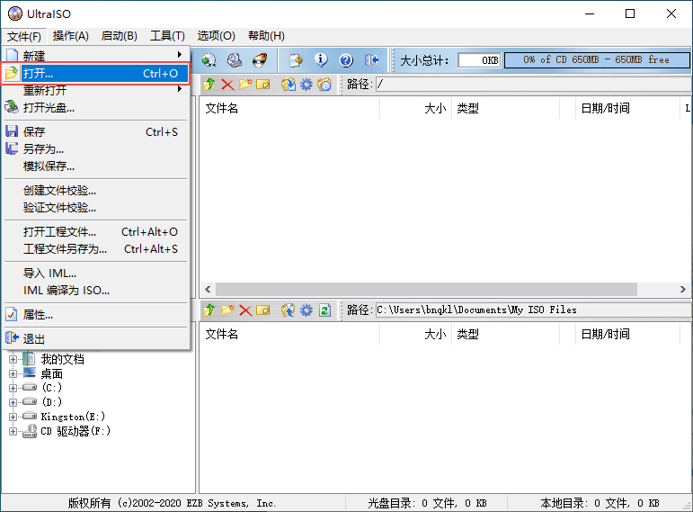
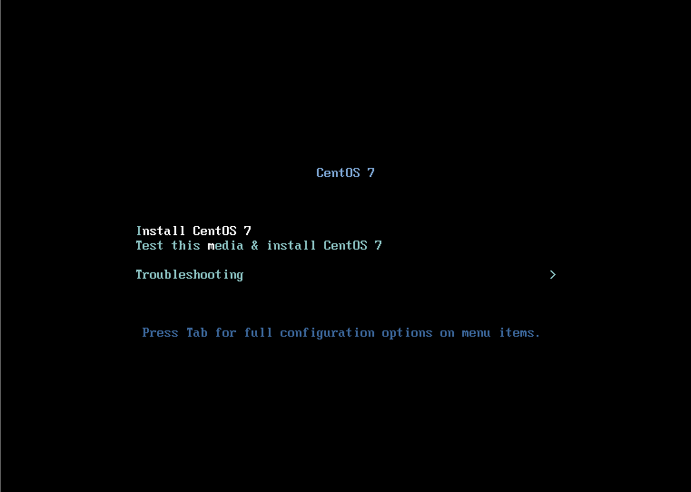
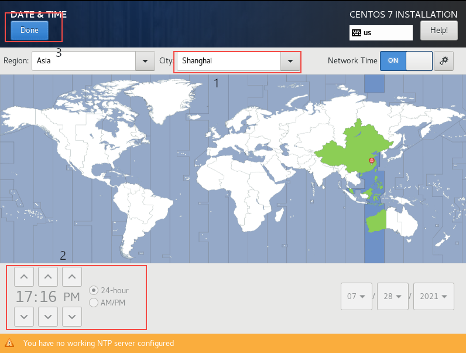
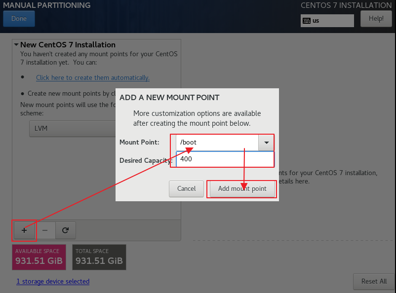
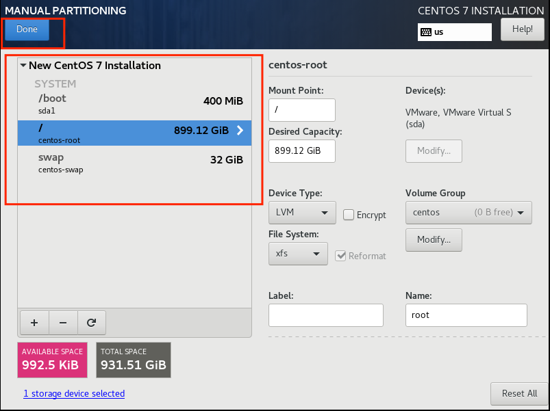
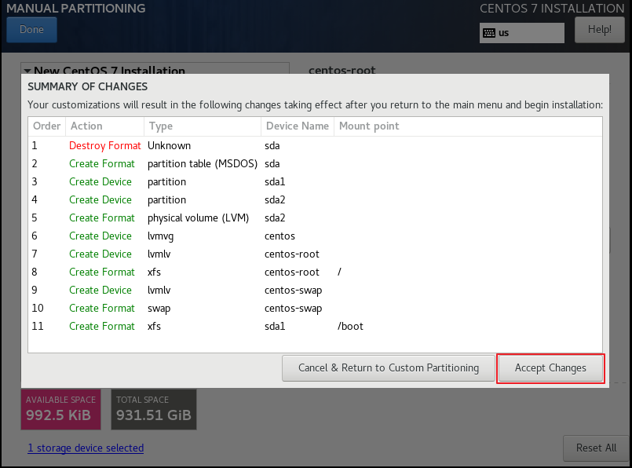
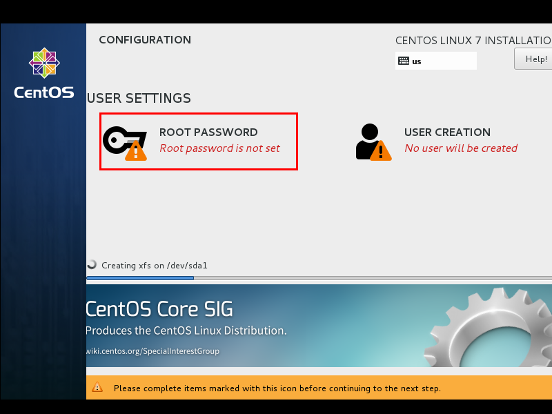

# Build a Linux environment

## Make U disk boot disk (installation disk)

1. Use the UltraISO tool: File -> Open and select the ISO file (centos iso installation file)
   

2. Click the menu in turn: Start -> Write hard disk image

   
   

   
   
3. Select the corresponding U disk and click Write to complete the U disk installation disk.
   

## Install Linux system

Insert the prepared U disk into the computer where the system is to be installed, and set the BIOS startup item to boot from the U disk. After starting, you enter the installation interface.

1. After booting from the U disk, the following interface will appear:

   - Install CentOS 7 Install CentOS 7
   - Test this media & install CentOS 7 test the installation file and install CentOS 7
   - Troubleshooting

   Select the first item, install CentOS 7 directly, press Enter, and enter the following interface
   
2. Select the first item, install CentOS 7 directly, press Enter, and enter the following interface

   
   

3. Select the language used during the installation process, here select English, keyboard select American keyboard. Click Continue
   

4. First set the time
   

5. Select Shanghai as the time zone and check whether the time is correct. Then click Done
   

6. Select the software to be installed
   

7. Select Minimal Install, then click Done
   

8. Select the installation location, where you can partition the disk.
   

9. Select i wil configure partitioning (I will configure partitioning), and then click done
   

10. As shown in the figure below, click the plus sign, select /boot, and divide the boot partition into 400M. Finally click Add
    

11. Then use the same method to allocate space to the other three areas and click Done
    

12. Then the summary information will pop up, click AcceptChanges (accept changes)
    

::: tip
<pre>

Suggestions on how to set the partition size:
Generally speaking, there are at least two mount points in a linux system, namely / (root directory) and swap (swap partition), among which / is required;
Suggest several directories and sizes for general mounting:
   /swap directory 32G # If the memory is less than 4G, it is twice the memory. If the memory is greater than 4G, the size of the memory can be the same.
   /boot directory 400M # The static link file of boot loader, which stores the programs related to Linux startup
   / (Root) directory # all remaining
</pre>
:::

13. Set the host name and network card information
    

14. First, turn on the network card, and then check whether the IP address can be obtained, and then click Done after changing the host name.
    

15. Finally select Begin Installation
    

16. Set the root password
    

17. Click Done after setting the root password
    

18. Wait for the system to be installed and restart the system
    