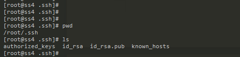
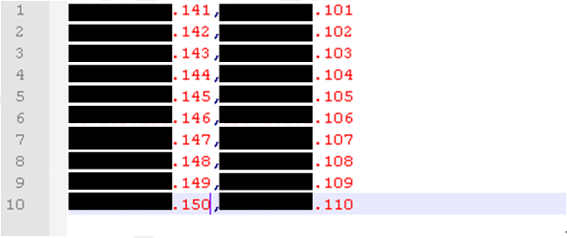
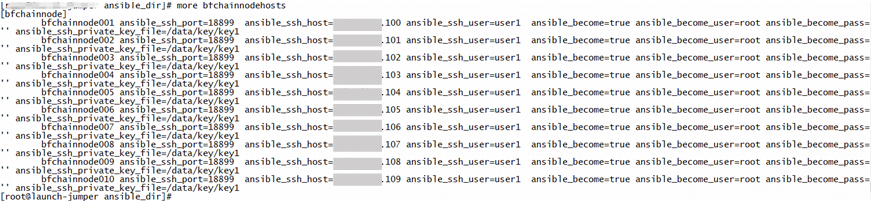
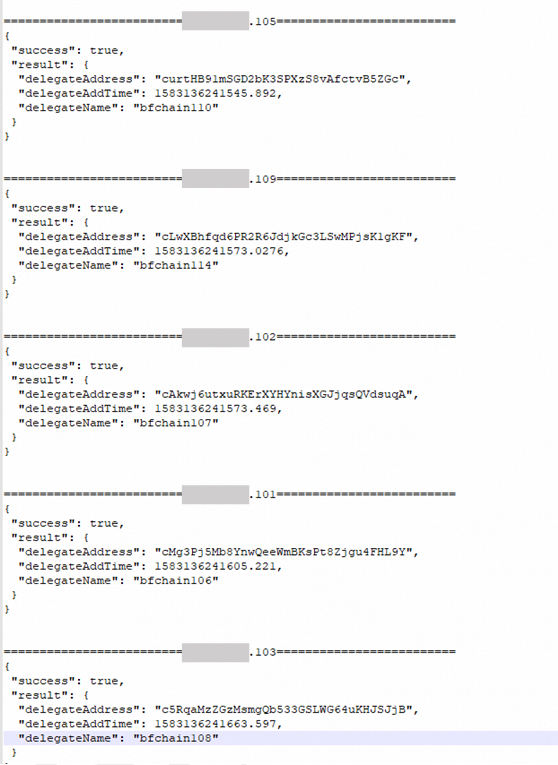

# Node deployment

This chapter will introduce how to deploy nodes, including node deployment and chain deployment.

## Deployment method

### Single node deployment

Follow the steps below to deploy a single node:

1. Install the node program (BCF.exe) of the Biological Chain Forest data center version on a single node;
   
   Follow the instructions in Chapter 3 of this article to complete the installation and configuration of BCF.exe. After the configuration is successful, double-click BCF.exe to run the node. If it is prompted that it is not authorized, follow the [\<Node authorization application\>](/en/Tutorials/PC_full_node_tutorial/Windows/install.md#node-authorization-application) to run the node after completing the node authorization.

2. Switch node network environment: please refer to [\<Configure Network Environment\>](/en/Tutorials/PC_full_node_tutorial/Windows/install.md#configure-network-environment);

3. Switch the chain of node operation: please refer to [\<Configure the chain that the node runs\>](/en/Tutorials/PC_full_node_tutorial/Windows/install.md#configure-the-chain-that-the-node-runs);

4. Binding address: Please refer to [\<bind address\>](/en/Tutorials/PC_full_node_tutorial/Windows/install.md#bind-address).

After the above operations are successful, single-node deployment can be realized.

### Multi-node deployment

The following will take the deployment of three nodes as an example to explain how to deploy the same chain of Biological Chain Forest data center version node program (BCF.exe) on multiple nodes.

#### Installation

Install BCF.exe on three different nodes (the node IPs are `192.168.0.1`, `192.168.0.2`, and `192.168.0.3` respectively) according to the installation steps in the manual. After the installation is successful, double-click BCF.exe to run the node. If it is prompted that it is not authorized, follow the [\<node application authorization\>](/en/Tutorials/PC_full_node_tutorial/Windows/install.md#node-authorization-application), and you can run the node after completing the node authorization.

#### Configuration

To achieve node synchronization between multiple nodes, configure the node synchronization IP list, and automatically connect to the nodes in the list after the node is started. The specific operation method is as follows:

1. Switch node network environment: please refer to [\<Configure Network Environment\>](/en/Tutorials/PC_full_node_tutorial/Windows/install.md#configure-network-environment);

2. Switch the chain of node operation: please refer to [\<Configure the chain that the node runs\>](/en/Tutorials/PC_full_node_tutorial/Windows/install.md#configure-the-chain-that-the-node-runs);

3. Add the IP of the node to be synchronized (assuming that the user configures the official network):
   
   Configuration file path: `/installation directory/conf/bft-config-mainnet.json` (if the user configures the test network, modify the `bft-config-testnet.json` file). Configure the ip of the node to be connected in the peers list, so that it will automatically synchronize with the node during operation.
   
   For example, this node (`192.168.0.1`) needs to synchronize the other 2 nodes (`192.168.0.2`, `192.168.0.3`), which can be configured according to the following figure.
   
   

4. Binding address: Please refer to [\<bind address\>](/en/Tutorials/PC_full_node_tutorial/Windows/install.md#bind-address).

> Note 1: Three nodes are deployed, so at least 3 blocks are required for each round, and at least 3 trustees need to be set here. We recommend 57 blocks and 114 trustees per round;

> Note 2: The genesis block can be created by a node, then copy the genesis block to the `genesisInfos` folder of the node installation directory, and modify the configuration file according to the above steps to run;

> Note 3: Blockchain authorization is required to run non-BFChain chains. For details, please see \<[Blockchain authorization](/en/Tutorials/PC_full_node_tutorial/Windows/install.md#blockchain-authorization-application)\>.

#### Run

After completing the above configuration, you can implement multi-node deployment.

### Large-scale deployment

#### Node server environment preparation

Take the `centos` system as an example to deploy 10 nodes in batches. You need to prepare a management server first, through which configuration commands are issued to each node server for configuration operations.

1. Configure the management server (the management server can log in to each node server with SSH):
   
   1. Create related directories:
      
      ```shell
       mkdir -p /data/ansible_dir
      
       mkdir -p /data/key
      
       mkdir -p /data/release
      
       mkdir -p /data/scripts
      ```
   
   2. Install the automated operation and maintenance tool aisible:
      ```shell
       yum –y install ansible
      ```
   
   3. Configure the python runtime environment
      ```shell
       yum -y install python-pip
      
       pip install paramiko multiprocessing
      ```
   
   4. Upload the node server configuration script to the management server directory /data/ansible_dir and decompress it:
      ```shell
       unzip os_initial.zip
      ```
      
      > Note: For the server configuration script, see os_initial.zip in the file attachment
   
   5. Generate a key pair:
      ```shell
       ssh-keygen -t rsa
      ```
      
      
   
   6. Paste the public key id_rsa.pub to:
      
      `/data/ansible_dir/os_initial/roles/set_sshd/files/public_keys/ops`
      
      ```shell
      mv id_rsa.pub /data/ansible_dir/os_initial/roles/set_sshd/files/public_keys/ops/id_rsa.pub
      ```
   
   7. Copy the private key file to the directory `/data/key/ mv id_rsa /data/key/id_rsa`
   
   8. Modify the username, port, and key in the cmd.py in the document attachment to the actual values, which respectively represent the user name, port, and path of the private key used to log in to the node server, and upload them to the management machine directory /data/scripts /in
   
   9. Create the file `/data/scripts/ip.txt` (node ​​server public network, private network ip) as follows:
      
      
   
   10. Create the information file `/data/ansible_dir/bfchainnodehosts` for the SSH login of the management server to each node server:
   
   The meaning of the example is as follows: 
   | [bfchainnode] | Group name |
   |:---------------------------- | -------------------- |
   | `ansible_ssh_port` | SSH login port of the management machine connected to the node |
   | `ansible_ssh_user` | The user name for logging in to the management machine to connect to the node |
   | `ansible_become` | Activation privilege escalation (sometimes you need to use the root user) |
   | `ansible_become_user` | Set as a user with required permissions |
   | `ansible_become_pass` | This user's password |
   | `ansible_ssh_private_key_file` | Path of the private key | 
   
   

2. Configure node server
   
   1. Modify the `/data/ansible_dir/os_initial/default.hosts` file, configure the node server ip and login method:
   
      
   
   2. Run the script to configure the node server operating environment:
   
   ```bash
   ansible-playbook /data/ansible_dir/os_initial/default.hosts/os_initial.yml -i
   /data/ansible_dir/os_initial/default.hosts
   ```

#### Node server deploys BFChain package

1. Compress the installed node into a .zip compressed package.

2. Upload the release package BFChain.zip to the management server directory: `/data/release/bfchain.zip`

3. Distribute the BFChain release package to each node server:
   
   ```
   ansible bfchainnode -i /data/ansible_dir/bfchainnodehosts -m copy -a
   "src=/data/release/bfchain.zip dest=/data/release/bfchain.zip"
   ```

4. Run the node server deployment script:
   
   ```python
   python /data/scripts/cmd.py "sudo sh /data/scripts/update_bfchain.sh"
   ```

5. Start nodes in batches
   
   ```
   ansible bfchainnode -m shell -i /data/ansible_dir/bfchainnodehosts -a
   'systemctl start supervisord '
   ```

#### Batch management/execute node commands

Execute `command` commands in batches on nodes by calling `ansible`. as follows:

```
ansible bfchainnode -m shell -i /data/ansible_dir/bfchainnodehosts -a'command'
```

> Note: `command` is the command to be executed

For example, if you execute `–glb` in batches, you can get it by entering the following commands.

### Multi-chain deployment

If the user wants to deploy multiple chains of the Biochain Forest Data Center version on a certain node, for example, if the user wants to deploy BFChain and another chain, FINChain, they can follow the steps below:

1. The user downloads and installs the Biological Chain Forest data center version (BCF), and modifies the configuration file according to the above \<[single-node deployment](/en/Tutorials/PC_full_node_tutorial/Windows/deploy.md#single-node-deployment)\> method, and deploys after startup BFChain succeeded.

2. According to \<[Configure the chain that the node runs](/en/Tutorials/PC_full_node_tutorial/Windows/install.md#configure-the-chain-that-the-node-runs)\>, switch to the creation block operation of FINChain, and check the corresponding configuration file. Configuration file path: `/installation directory/conf/"chain name"-config-"network type".json`.
   
   For example: chain name = "fin", network type = `mainnet` (official network: `mainnet`; test network: `testnet`). Then the official network path of FINChain is as follows: `/installation directory/conf/fin-config-mainnet.json`.

3. If users deploy another chain, they can follow step 2.

## Networking mode

### Public chain deployment

1. If you want to run the official network of BFChain public chain nodes, follow the steps of \<[Single Node Deployment](/en/Tutorials/PC_full_node_tutorial/Windows/deploy.md#single-node-deployment)\> and set the configuration file `/installation directory/conf/ Parameters in base-config.json`:
   
   1. "`isGenesisBlockProvidedExternally`" is set to `false`
   
   2. "`bnid`" is set to `b`

2. If you want to run the test network of BFChain public chain nodes, then
   
   1. "`isGenesisBlockProvidedExternally`" is set to `false`
   
   2. "`bnid`" is set to `c`

### Consortium chain deployment

1. You need to contact the Biochain Forest BCF team to apply for the genesis block of the alliance chain.

2. The access authority of the alliance chain is managed when the network is deployed, and the access authority is not managed on the blockchain.

3. Follow the steps of \<[Single Node Deployment](/en/Tutorials/PC_full_node_tutorial/Windows/deploy.md#single-node-deployment)\> to deploy nodes using the Alliance Chain Genesis Block.

4. According to \<[Multi-node deployment](/en/Tutorials/PC_full_node_tutorial/Windows/deploy.md#multi-node-deployment)\>Configure the IP of the node connection, which can realize the synchronization of each node.

5. Independent management of each node between organizations\<[Configure the user name and password of the database](/en/Tutorials/PC_full_node_tutorial/Windows/install.md#configure-the-user-name-and-password-of-the-database)\>

### Private chain deployment

1. You need to contact the Biochain Forest BCF team to apply for the genesis block of the private chain.

2. Follow the steps of \<[Single Node Deployment](/en/Tutorials/PC_full_node_tutorial/Windows/deploy.md#single-node-deployment)\> to deploy the node using the private chain genesis block, so that the private chain can be started when the node is running.

3. According to \<[Multi-node deployment](/en/Tutorials/PC_full_node_tutorial/Windows/deploy.md#multi-node-deployment)\>Configure the IP of the node connection, which can realize the synchronization of each node.

4. Reset the blockchain on the private chain. See \<[Blockchain data reset](/en/Tutorials/PC_full_node_tutorial/Windows/faq.md#blockchain-data-reset)\>. If there are multiple nodes, it needs to be reset on each node.

## Start-stop block

### Bind a single address

For details, please refer to [\<Bind Address\>](/en/Tutorials/PC_full_node_tutorial/Windows/install.md#bind-address).

### Binding addresses in batches

1. Refer to \<[node server environment preparation](/en/Tutorials/PC_full_node_tutorial/Windows/deploy.md#node-server-environment-preparation)\>, upload the bandkeyhosts file to /data/ansible_dir/bandkeyhosts of the management server and configure the corresponding values ​​according to the following table . 

| bfchainnode001                              | Alias |
| ------------------------------------------- | ---------------------- |
| `ansible_ssh_port=18899` | Node login ssh port number |
| `ansible_ssh_host=192.168.0.1` | Intranet ip that the node can log in to with SSH |
| `ansible_ssh_user=user1` | The node logs in as the user ssh |
| `ansible_become=true` | Whether to enable sudo permissions |
| `ansible_become_user=root` | The user used to execute the command after switching sudo |
| `ansible_become_pass=''` | Switch the password used by sudo (enter the password in single quotes) |
| `ansible_ssh_private_key_file=/data/key/key1` | Secret key file for ssh login |
| `secretkey` | The principal's secret key bound to the node (enter the secret key in single quotes)   |

2. Enter the following commands in the management machine to bind trustees in batches:
   ```shell
    ansible bandnode -i /data/ansible_dir/bandkeyhosts -m shell -a "cd
    /data/bfchain; ./bcf --bindingAccount
   
    systemSecret=\\"your node password \\",delegateSecret=\\"{{secretkey}}\\" "
   ```


  
