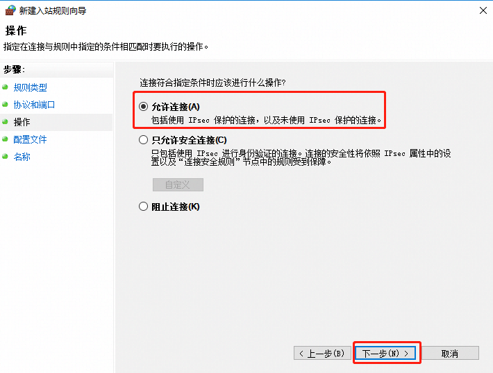
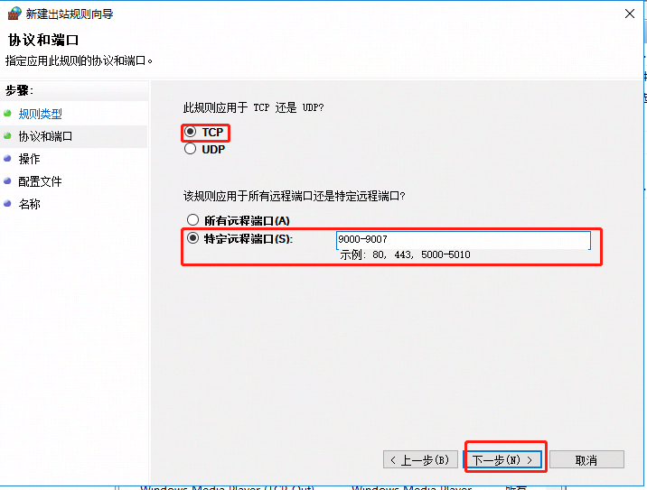
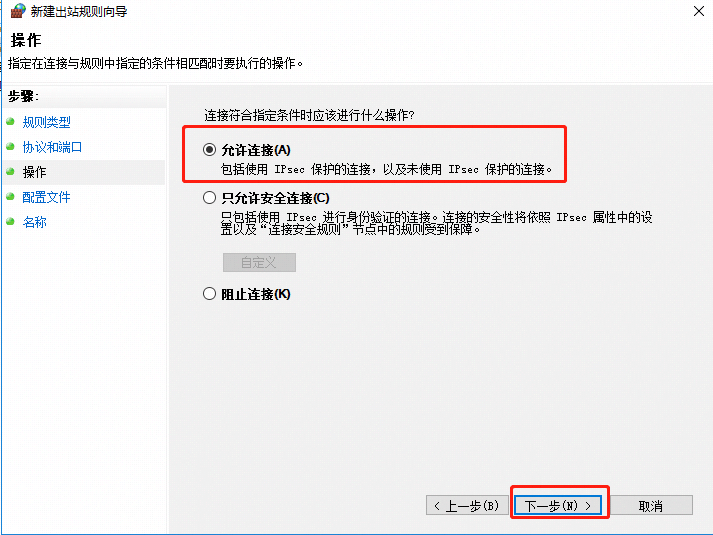
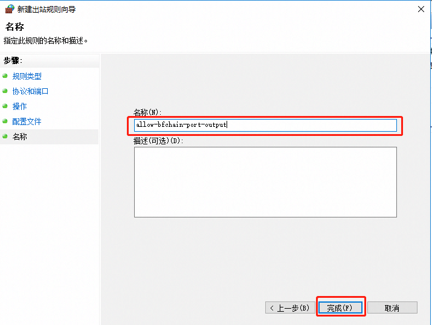

# Common problem sorting

This chapter will introduce the solutions to common problems that may be encountered when using the BCF.exe version of the Biological Chain Forest data center. If you encounter a problem that is not listed in this chapter, please contact the BCF team (email address: service@bfchain.org) for more support.

## Data generated when the node is running

The data in the following folders are all important data, the details are as follows:

1. `chaindata` folder: `chaindata` saves all the data of the current node's blockchain.

2. `logs` folder: `logs` saves the running log of the current node. For the description of the log file, please refer to the noun explanation\<[log file name and content description](/en/Tutorials/PC_full_node_tutorial/Windows/glossary.html#log-file-name-and-content-description)\>.

3. `backup` folder: `backup` saves the key checkpoint data, which is used to quickly start or restore the node. If the data in this folder is lost, the node can still start normally, but it will take more time to rebuild the area Block chain.

## Blockchain data reset

If users want to reset the blockchain, they can delete the directory `chaindata` and all the files in the directory.

## Automatically run on boot

If you want to automatically run BCF.exe when the node starts, there are the following ways.

1. Add the BCF.exe icon under the startup folder of the start menu
   
   1. Find the path of `StartMenu\\Programs\\Startup` (The path depends on the location of the user's computer settings. For example, the path of the self-starting file under the C drive is: `C:\\username\\Microsoft\\Windows\\Start Menu\\Programs\\Startup`), copy the path
   
   2. Run (`win+R key`), then paste the path copied in step 1) into the input box, and press Enter.
   
   
   
   1. Enter the self-starting folder of the start menu
   
   
   
   1. Return to the desktop, find the BCF.exe icon, click the right mouse button, and select "copy" the BCF.exe icon
   
   
   
   1. Paste the copied BCF.exe icon into the self-starting folder in step 3 to complete the configuration of automatic operation on startup
   
   

## Set node log level

If users want to change the log level displayed in the log file under `logs`, they can set the log level on the node. The specific steps are as follows:

1. Modify the configuration file before starting BCF.exe, the configuration file path: `/installation directory/conf/bft-config-testnet.json`. Modifying the parameters `consoleLogLevel` and `fileLogLevel` can realize the function of adjusting the log mode of console output and file output.


1. There are 3 types of log levels:
   
   1. `info`: Information mode, provides the most effective information prompts, so that users can clearly understand the current running status of the node and the running process;
   
   2. `warn`: Warning mode, the information in the information mode will no longer be output, only warning and error messages will be output;
   
   3. `error`: Error mode, only output information about errors during node operation.

We recommend using the `info` mode, so that you can understand the running status of the node, and also capture errors that occur during the node's operation.

## Node automatic voting function

The following describes how to implement node automatic voting function

1. Modify the configuration file before running to realize the automatic voting function
   
    Modify the configuration file, the configuration file path: `/installation directory/conf/`
   
   1. Official network configuration file \`bft-config-mainnet.json\`
   
   2. Test network configuration file `bft-config-testnet.json\`
      
       Modify the `enable` configuration to `true`, and run it after saving it to realize the automatic voting function.
      
      

Automatic voting parameter description 

| **Parameter name** | **Parameter description** | **Parameter content description**                                                                                                                                                                                                                   |
| ------------------------ | ------------------ | ---------------------------------------------------------------------------------------------------------------------------------------------------------------------------------------------------------------------------- |
| `enable`                 | Whether to activate the automatic voting function | true: activate the automatic voting function false: do not activate the automatic voting function |
| `useConfigFee` | Whether to use configuration file setting fee | true: use configuration file fee false: do not use configuration file fee |
| `fee` | Default voting fee | Default voting fee for each voting event |
| `numberOfcheckTrsBlock` | The number of event confirmation blocks | The number of confirmation blocks for each voting event. If there is no confirmation vote for blocks exceeding this number, the vote will not be retryed |
| `maxNumberOfRecommended` | The upper limit of the number of recommended voters selected each time | The number of recommendations is between 0-maxNumberOfRecommended |
| `numberOfRounds` | Candidate recommender's selection round range| The selected end height is: if the current round is the first round, the end height is the latest block height, if it is greater than the first round, the end height is the previous one The last block of the round; the selected starting height: if the current latest block height is greater than the number of blocks calculated by numberOfRounds, the starting height is the latest block height-numberOfRounds \* The number of blocks in each round, if the latest zone If the block height is less than or equal to the number of blocks calculated by numberOfRounds, the starting height is 2 (a block with a height of 1 is the genesis block packaged by the genesis account and is not included in the recommended list) |
| `productivityPercent` | The proportion of account online rate when calculating candidate recommenders | The number of recommenders selected according to the online rate ranking is: the total number of candidates \* numerator/ denominator |
| `forgedBlocksPercent` | When calculating candidate recommenders, the proportion of account block number | The number of recommenders selected according to the number of blocks is: the total number of candidates \* numerator/ denominator |

1. After running, modify the configuration file to realize the automatic voting function
   
    According to the automatic voting field of \<[Set node configuration information](/en/API_reference/PC_full_node/Interface_list/1-4.html#15-set-node-configuration-information)\>, the configuration information can be dynamically adjusted during the operation of the node.
    As shown in the figure below, you can turn on automatic voting.


## Firewall configuration

### Use of Port

1. TCP: Each chain uses a blockchain port by default. For BCF, the official network is 9000 and the test network is 19000. In addition, in order for the program to run normally, it is recommended to reserve the last ten ports of this port for use, such as 19000-19010. Open the configuration file of the chain that needs to be run. There are port configurations at the top of the file. If these ports conflict with other programs that the current node has started, you can configure them yourself. For details, please refer to the port configuration of [\<Configuration file description\>](/en/Tutorials/PC_full_node_tutorial/Windows/install.html#configuration-file-description).

2. UDP: Due to the existence of `stunserver`, udp ports of 49152-65535 need to be configured.

### Firewall configuration

The following explains how to configure the ports that are open to the outside world.

#### Windows

In the start menu, follow the steps below and click `Control Panel—\>System and Security—\>Windows
Firewall`, enter the Windows firewall settings interface, and click "Advanced Settings" on the left side of the interface. 

1. Inbound rule settings
   
   1. Select the inbound rule and then create a new rule, select the port, and then "Next"
      
      
      
      
   
   2. Select TCP, select a specific port and enter the port. Multiple consecutive ports are separated by `-`, for example: 9000-9007
      
      
      
      
   
   3. Choose to allow the connection
      
      
   
   4. Select the scope of the application rule
      
      
   
   5. Enter the rule name
      
      

2. Outbound rule settings
   
   1. Select the inbound rule and then create a new rule, select the port, and then the next step
      
      
      
      
   
   2. Select a specific TCP port, and then enter the port, separate multiple consecutive ports with "-", for example: 9000-9007
      
      
   
   3. Choose to allow the connection
      
      
   
   4. Select the scope of the application rule
      
      
   
   5. Enter the rule name
      
      
      
      At this point, the open TCP: 9000-9007 firewall rule setting is complete;
   
   6. Please refer to the above steps to set up open firewall UDP: 49152-65535 port rules.

#### Linux

Use the `firewalld` that comes with `Centos7` for firewall configuration:

1. Open the tcp port of 9000-9007:
   ```shell
    firewall-cmd --permanent --zone=public --add-port=9000-9007/tcp
   ```

2. Open the udp port of 49152-65535:
   ```shell
    firewall-cmd --permanent --zone=public --add-port=49152-65535/udp
   ```

3. Refresh the configuration to make it effective immediately:
   ```shell
    firewall-cmd --reload
   ```

   

## About the problem that the program stops when running the node program

Since the text editing and other operations in the Windows console will cause the program to temporarily stop (press "Enter" to continue running), it is recommended to configure the following in the console:

1. Right-click the toolbar at the top of the console and click "Properties"
   
   

2. Turn off the check box of "Quick Edit Mode" and click "OK".
   
   

 

## About viewing the running status of nodes

The following introduces several ways to check whether the node is running normally

1. Use \<[Get node status interface](/en/API_reference/PC_full_node/Interface_list/1-2.html#get-node-status)\> to check the status of the node.

2. Use \<[Get current latest block of local node](/en/API_reference/PC_full_node/Interface_list/1-2.html#get-current-latest-block-of-local-node)\> to observe whether this node can maintain the same height as other nodes, If possible, the node is operating normally.

3. According to the log, check the log of the blocking process and search for the "error" keyword. If there is no error, the node is running normally. In general, when a node has an unrecoverable error, it can be reflected in the block process log. For details, please refer to \<[Log file name and content description](/en/Tutorials/PC_full_node_tutorial/Windows/glossary.html#log-file-name-and-content-description )\>.

## Common mistakes

### Genesis block mismatch error

If the genesis block does not match as shown in the figure below, please check whether your genesis block matches. If the genesis block does not match, please specify your genesis block again. If you want to re-run a new chain, please uninstall and delete the data directory and reinstall it before using it.


### Username and password are not configured

If there is an error on the interface as shown in the figure below, it means that the user name and password are not configured, please refer to [\<configuration database user name and password\>](/en/Tutorials/PC_full_node_tutorial/Windows/install.html#configure-the-user-name-and-password-of-the-database) to configure the database user name and password.


### Node authorization expired

If there is an error on the interface as shown in the figure below, it means that the node authorization has expired. Please contact the BCF team (email address: service@bfchain.org) to re-authorize.


### Node authorization is about to expire

If there is an error on the interface in the following figure, it means that the node authorization is about to expire. Please contact the BCF team (email address: service@bfchain.org) to obtain a new authorization before it expires. 


