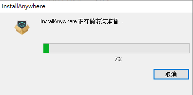
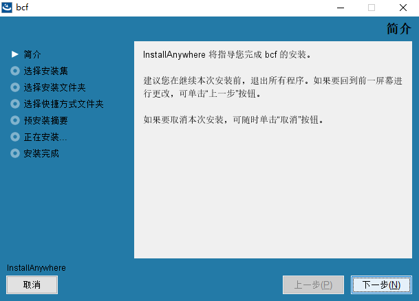
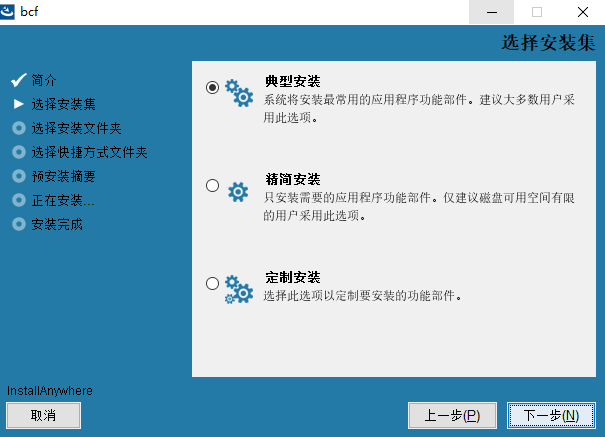
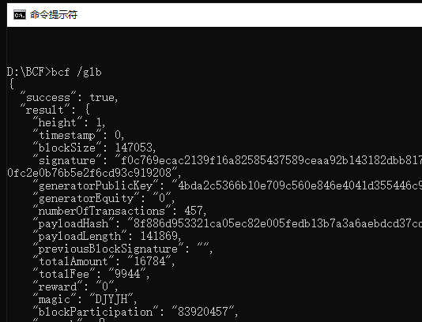
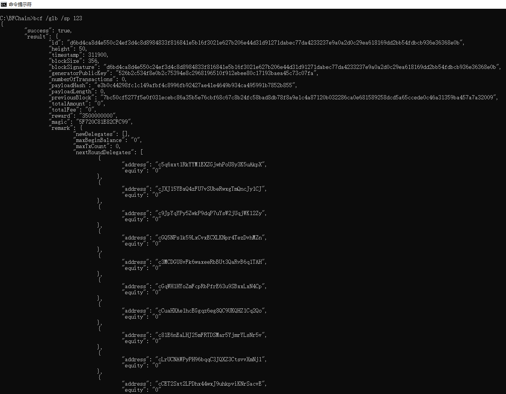
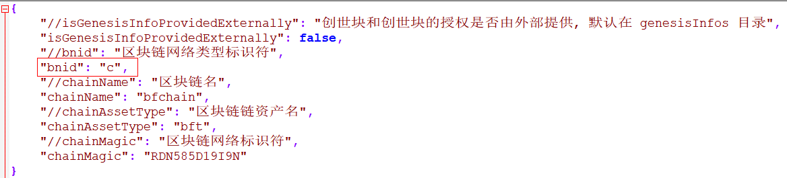
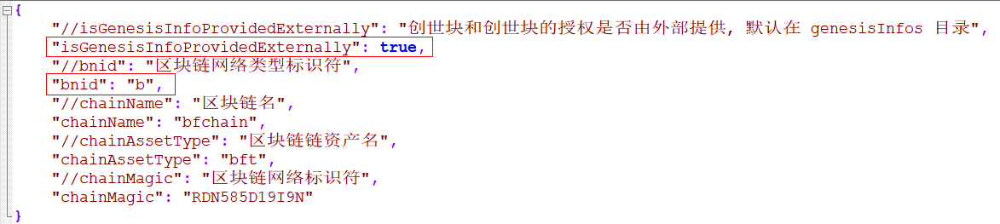
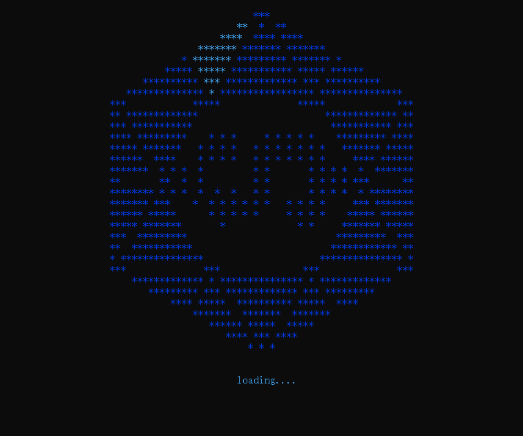
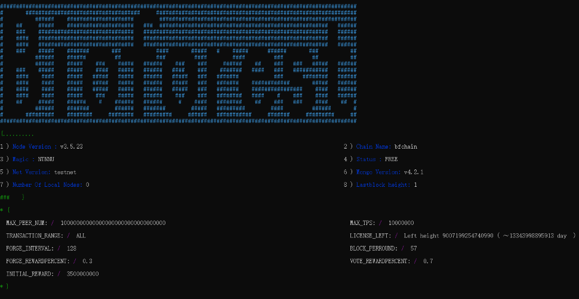
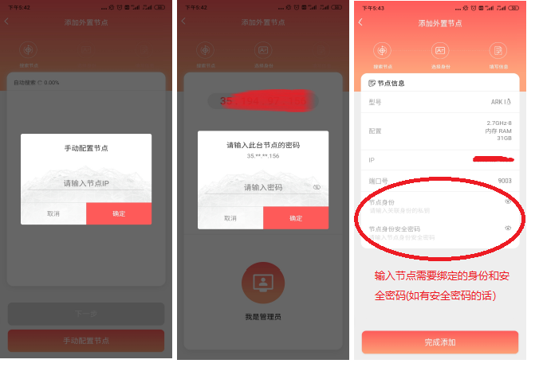

# Install and run

This operation manual is applicable to the BCF node program of V 3.6.62 and above.

## Operating environment

In order to ensure that you can run the BCF node program smoothly, we recommend that you use the following configuration equipment:

- CPU: 16 cores (main frequency 3.0G+)

- Memory: 32G

- Hard disk: SSD 2T or above

- System: Win10 64-bit and Windows Server2008+ operating system

## Installation and operation steps


## Install the app

This chapter will introduce how to install and uninstall the BCF node program under the Windows operating system.

### Install

1. Installation preparation
   
   You need to download the BCF node program package from the official channel first. The official download address is:

   Click the downloaded BCF node program installation package to enter the installation preparation interface as shown in the figure below:
   
    


2. Language selection
   
   After the loading is completed, it will automatically jump to the language selection interface as shown in the figure below, and the user can select the language according to actual needs. Currently supports two languages ​​"Simplified Chinese" and "English", and the default is "Simplified Chinese":
   
    


3. Select the installation set
   
   Select the language and click "OK" to enter the BCF node program installation wizard interface, as shown in the following figure:
   
    

   
    Click "Next" and follow the interface prompts to select the appropriate installation set, the default is "Typical Installation":
   
    


4. Select the installation directory
   
    


5. Select Shortcut
   
   BCF provides a variety of options for creating shortcuts:
   
   

   
   1. In the new program group: select this method, after installation, a new folder will be added in the "Start" menu bar to store the BCF.exe shortcut icon, and the folder name is named by the user in the figure above name;
   
   2. In the "Start" menu: select this method, and the BCF.exe shortcut icon will be added directly in the "Start" menu bar after installation, and the user can search by letter;
   
   3. On the desktop: select this method, and the BCF.exe shortcut icon will be created directly on the desktop after installation;
   
   4. In the quick launch bar: select this method, the BCF.exe shortcut icon will be placed in the quick launch bar after installation;
   
   5. Others: users can choose to create BCF.exe shortcut icon in the specified location;
   
   6. Don't create icon: Don't set a shortcut icon for BCF.exe. If you want to use it, you need to open it in the installation directory.


6. Preview of installation information
   
   Before the formal installation, the interface will display the installation information set by the user. Click "Back" to modify the configured information;
   
    


7. Installation
   
   

   
   


8. Successful installation
   
   After installation, the shortcut startup icon of the BCF node program will be displayed in the preset shortcut:
   
   
   
   
   
   > Note: After the BCF node program is successfully installed, the default software has been started, and the user does not need to start the software again.


### Uninstall


The user can uninstall the BCF node program of the biological chain forest through the following two paths:

1. Open the control panel [Control Panel]-\>Open the program [Programs]-\> Open the program and features [Programs and Features], select the application [bcf], click "Uninstall/Change" to uninstall, as shown in the figure below :
   
    

   
   After clicking "Uninstall", a message as shown in the figure below appears, select "Next" and follow the steps to uninstall:
   
    


2. Click the [Start] menu, find the shortcut icon of the BCF node program, right-click, and in the pop-up window, select "Uninstall" and uninstall according to the operation prompts, as shown in the following figure:
   
   
    

   
   > Note: After any of the above paths are successfully uninstalled, the BCF node program icon will not be found on the desktop and menu buttons. The current uninstallation will retain the data files and log files of the current chain. If you want to completely clear the files, you need to delete all files and sub-files in the installation directory.

## Genesis block application

### Apply for Genesis Block

After the BCF node program is installed, the default operation is the main chain of the biological chain forest BFChain. If users want to create and run a blockchain of their own, they need to apply to the Biochain Forest team to create a genesis block in the form of email.

The email must contain the following information:

1. Genesis block applicant: fill in the name of the applicant;

2. Application items: describe the items that need to be applied for in this email, such as "Generation Block Creation Application"

3. Genesis block information: After a successful application for the genesis block, the Biochain Forest team will provide a json file containing the genesis block information. Please add this information to the email as an attachment;

4. Apply to create the node serial number of the genesis block: How to obtain the node serial number information, please refer to \<[Get Node Serial Number](/en/Tutorials/PC_full_node_tutorial/Windows/install#Get Node Serial Number)\>;

5. Purpose of the applied-for genesis block: Please describe clearly the purpose of the applied-for genesis block, such as development, testing, production, etc.


Send the above information to the email address <license@bfchain.org>.
   

After receiving the successful email reply (usually 1-3 working days), please download and copy the `license.json` file in the attachment to the `/genesisInfos` directory under the BCF node program installation directory. Complete the blockchain authorization.

> Note: The file name format of the json file containing the genesis block information is: `x-genesisBlock-y.json`, `x` refers to the main equity name, and `y` refers to the test network or the official network. As shown in the figure below, `msc-genesisBlock-testnet.json` represents the genesis block of the testnet with the main equity name `msc`. If the genesis block you applied for does not have this file, please contact the BCF team of Biochain.


### Get the node serial number

You can obtain your BCF node program serial number in the following ways:

1. Open the BCF node program;

2. Obtain the serial number of the node to be authorized:
   
   You can directly scan the QR code in the figure below with your mobile phone, or directly copy the serial number under the QR code to obtain the authorized serial number of the node. For example, the node sequence number in the figure below is:
   
   86948f903169788f071ff427bdbffc5e372da00d32a22958dc9ca1139540b1d3
   
    


## Change setting

### Configuration file description

After the installation is successful, you can find the BCF configuration file in the `/conf` folder under the installation directory. The following table uses the `bft-config-testnet.json` file as an example. The description of each field contained in the file is as follows:

| **Parameter name**                         | **Parameter description**                                                                            |
| ------------------------------- | ----------------------------------------------------------------------------------- |
| chainPort                       | The port number that the node may use, you need to pay attention to avoid the occupied port. Generally speaking, it is recommended to use the 10-digit port number behind the blockchain port for configuration. The bfchain test network blockchain port number here is 19000 |
| \- turnserver | The port of the hole-punching server, the default is 19001, it should be noted that the hole-punching server will use the configured port and the port of the configured port+1, which will occupy 19002 |
| \- system_websocket_port | Port number occupied by the Websocket interface, default 19003 |
| \- clusterLock | The port used by the process lock is used internally by the node. The default is 19004 |
| \- grpc | Port number occupied by the Grpc interface. The default is 19005 |
| \- update_service_port | Update program access port: the port number occupied when the underlying system of the blockchain provides the automatic version upgrade function |
| \- service_port | Service market access port: the port number occupied when accessing the node service market |
| \- mongodb | The port number used by Mongodb, the default is 19010 |
| transactionConfig | About event related configuration |
| \- receiveVoteEnable | Whether to receive votes |
| \- minFeePerByte | Minimum fixed fee, the minimum fee required for an event = minFeePerByte\*event byte length |
| &emsp;- numerator | Number, default is 1, numerator |
| &emsp;- denominator | Number, default is 153, denominator |
| \- maxFee | Maximum handling fee for automatic voting events, unit: this |
| \- maxTransactionLimitForVote | The maximum number of voting transactions that can be processed in each round |
| \- transactionsLimitPerBlock | Block event threshold |
| \- autoVote | Automatic voting related configuration |
| &emsp;- enable | Whether to enable automatic voting |
| &emsp;- useConfigFee | Whether to use configuration fee |
| &emsp;- fee | Handling fee |
| &emsp;- priorRecommendedNumber | Whether to give priority to guarantee the number of recommenders |
| &emsp;- maxNumberOfRecommended | Maximum number of recommended recommenders selected |
| &emsp;- numberOfRounds | The selected block range, the last 100 rounds |
| &emsp;- productivityPercent | Online rate percentage |
| &emsp;- forgedBlocksPercent | Percentage of blocked blocks |
| &emsp;- applyTxPercent | Percentage of packaged transactions |
| &emsp;- votePercent | Percentage of votes in the previous round |
| &emsp;- newDelegatePercent | Percentage of new trustees |
| &emsp;- minBeSelectProductivity | The minimum account online rate that can be recommended |
| coreForProcess | Number of processes started |
| \- forceUseConfig | Whether to use the number of processes under this configuration, the default is true, if it is false, the node automatically adopts the best solution according to the number of CPUs |
| \- coreNumForDealTransaction | The number of event processing processes, the default is 1, and it is recommended to be the same as the number of CPU cores, which will improve tps performance |
| \- coreNumForMemInfo | The number of processes to process accounting, the default is 1, and it is recommended to be the number of CPU cores/5, rounded up |
| \- coreNumForUntreatedTrs | The number of processes that store untreated events, the default is 1, and the recommended number is the number of CPU cores/5, rounded up |
| logConfig | About log file configuration |
| \- consoleLogLevel | Console log level, provides three modes: info: information mode, provides node status and error log warn: warning mode, provides warning and error log error: error mode only outputs error log The default is info |
| \- fileLogLevel                 | File log level, three modes are provided, info, warn, error, the default is error, only error log is output |
| \- fileLogLimit | The size limit of a single log file, unit: byte, default is 1000000000 |
| \- fileLogBackup | The number of backup logs, the default is 5. When a single log file exceeds the limit, the log backup will generate a new log file, and this log file will retain 5 copies |
| \- fileLogDateExpire | Whether to use the log expiration time, the log will be cleared after the expiration time, the default is false |
| \- fileLogDaysToKeep | The number of days to keep logs. When "fileLogDateExpire" is set to true, logs older than this number of days will be cleared, and the default is 30 days |
| networkConfig | Network related configuration |
| \- grpcEnable | Whether to enable Grpc, enabled by default |
| forging | Forging block related configuration |
| \- secret | Here you can directly configure the forger's private key and inject it through the configuration file, but it is generally not recommended because the private key shown here is in plain text |
| startConfig | Start related configuration |
| \- useCheckPoint | Whether to start using key checkpoints, the default is true. The key check information will be obtained from the backup file. If there is a key point that meets the key point, it will start from the key, and if there is no key point, the blockchain will be rebuilt |
| \- numberOfReservedCheckPoint | Number of critical checkpoints |
| \- peers | Node configuration: initial connection node IP |
| \- maxChannelNumber | The maximum number of other nodes that are allowed to actively connect to the current node |
| \- generateBlockEnable | Whether to open the forging block, true means to start forging the block, false means to stop forging the block |
| \- remark | Block remarks |
| reqCheckWhiteList | Request a restricted whitelist, the IPs in the whitelist can be accessed without traffic restrictions |
| mongoDb | Mongodb related configuration |
| \- externalConnection | Whether to enable external connection, the default is false, set to true to connect to Mongo through the LAN |
| \- user | Username and password |
| &emsp;- user | Username |
| &emsp;- pwd | Password |
| \- limitPerQuery | The limit of paging query, the default is 10000 |
| \- cmdLimitPerQuery | The limit of the command line paging query, the default is 20 |
| \- limitPerInsert | The limit for inserting data, the default is 10000 |
| \- dbPath | The path where Mongodb stores blockchain data |
| \- logPath | Mongodb log storage path |
| flowControlConfig | Flow Control Configuration |
| \- requestLimit | Request limit configuration |
| &emsp;- enable | Whether to enable this restriction |
| &emsp;- count | Restricted number of times |
| &emsp;- apiRequestInterface | API interface request times |
| &emsp;- time | Restricted time period |
| \- flowRequestLimit | Use flow request as limit                                                                           |
| &emsp;- enable                  | Whether to open the flow limit |
| &emsp;- count | Traffic request limit, unit: byte |
| &emsp;- time | Restricted time period |
| apiRequestBlackIp | Whether to enable the relevant configuration to add the IP that accesses the non-existent API to the blacklist |
|-apiRequestBlackIp | Whether to enable the blacklist of IP accessing non-existent APIs, the default is false |
| \- noticeConfig | When any of the following configuration conditions are met (for example, CPU usage\>=90%), a warning message will be sent to the mailbox only once within a certain time sendIntervalTime(S) |
| &emsp;- enable | Whether to enable sending warning messages to the mailbox |
| &emsp;- sendCondition | Send mailbox conditions |
| &emsp;&emsp;- usageCPU | CPU usage, the default is 0.9 |
| &emsp;&emsp;- usageDisk | Disk usage, the default is 0.9 |
| &emsp;&emsp;- usageMemory | Memory usage, the default is 0.9 |
| &emsp;&emsp;- missedBlocks | The number of missing blocks, the default is 5 |
| &emsp;&emsp;- sendIntervalTime | Send interval time, the default is 600000 milliseconds |
| miningMachineVersionName | Node's version name |
| \- miningMachineVersionName | Describe the version name of the node |
| interceptIllegalRequestEnable | Intercept illegal requests, enabled by default |
| serverMarketEnable | Whether to open the service market |
| diskMonitorConfig | Disk monitoring related configuration |
|-enable | Whether to enable disk monitoring, enabled by default |
| \- clearPath | Monitor disk path |
| \- clearWithSuffix | Clear file suffix name |
| \- noClearWithSuffix | Do not clean up file suffixes |
| \- checkInterval | Check interval, unit: hour                                                                        |


### Configure running password

#### Run password configuration


In order to ensure the safety of the user executing the command line tool, you can set a running password, and enter the password when executing each command to verify the user's identity.

The following will briefly introduce two ways to configure the running password. The second way will not leave a record in the command line, which is more secure. The second way is recommended.

1. Set the password directly in the command line
   
 Before starting the BCF node program formally, the user can add a key to the `PASSWORD` variable in the command line window and set the password required for command line access. Specific steps are as follows:
   
   1. Open a new Windows command line window;
   
   2. Enter the command in the command line window:


      ```
      set PASSWORD=123

      ```
   
   After the setting is successful, when the user executes any command in the BCF node program, the password will be required to proceed.

2. Set the password in the batch file
   
   1. Create a password setting file of `.bat`
      
      Copy the contents of the box below to the `.bat` file (change the password to your own password) and save the file:

      ```
      @echo off

      call set PASSWORD=123

      ```

   
   2. Execute `bat` batch file
      
      Execute the `.bat` file in `cmd` to complete the operation password setting.

      ```
      setPassword.bat
      
      ```

       

      
      > Note: It must be set before the BCF program is officially launched (referring to start by double-clicking the icon of the application program BCF.exe), and the password will be invalid after startup.

#### Other information

1. The user has not set a password
   
   If the user does not set a password, the command to query the current latest block information is directly executed in the command line window
   
   ```

   bcf /glb

   ```
   You can also get the latest block information:
   
    


2. The user has set a password
   
   If the user has a password, directly use the command `bcf /glb` to make an error, as shown in the following figure:
   
    

   
    If you want to call it correctly, you need to add the password `/sp 123` after each command line
    
    ```
    bcf /glb /sp 123

    ```
    The command execution result is as follows:
    


3. The user forgot the password
   
   If the user forgets the password, he cannot use the command line command to access the interface. In this case, the user can only close the program first and reset the password when restarting.

### Configure the network environment

BCF provides a test network and a formal network environment for users to use, and the default is the test network environment. Users can freely switch the operating environment of BCF according to actual needs.


Follow the steps below to switch between the official network and the test network:

1. Modify the configuration file, the configuration file path: `/installation directory/conf/base-config.json`:
   
   1. Set the parameters of `bnid` (blockchain network type identifier):
      
      1. If you want to run in a test network environment, set `bnid` to `c`
      
      2. If you want to run in a formal network environment, set `bnid` to `b`
      
      


> Note: In the subsequent use process, if the user needs to switch the node network status, it is best to close the BCF node program and restart it after the configuration is complete; otherwise, if the configuration file is modified during the BCF operation, the current configuration file can be saved. Success, but the configuration will not take effect. Only after restarting the modified configuration can it take effect.

### Configure the chain that the node runs on

BCF runs the BFChain chain by default, and it also supports switching between different chains. Users can freely switch the chain of current BCF node operation according to actual needs. This step is suitable for users who want to run the genesis block applied for by themselves or the genesis block obtained from outside.

Follow the steps below to switch between different chains:

1. Modify the configuration file, the configuration file path: `/installation directory/conf/base-config.json`:
   
   1. Set the `isGenesisBlockProvidedExternally` parameter:
      
      1. If you want to run your own or external chain, set `isGenesisBlockProvidedExternally` to `true`; at the same time, you need to modify the following parameter values ​​`chainName`, `assetType` and `chainMagic`;
      
      2. If you want to run the BFChain main chain, set `isGenesisBlockProvidedExternally` to `false`
      
      


The description of each parameter is as follows:

| **Parameter name** | **Parameter description** | **Parameter content description**                                    |
| ---------------------------------- | ------------- | --------------------------------------------- |
| `isGenesisBlockProvidedExternally` | Whether to start with your own genesis block | `true`: means to start the node with the specified genesis block `false`: means to start the node with BFChain |
| `bnid` | Blockchain network type identifier | `c`: means to start in test network mode `b`: means to start in official network mode |
| `chainName` | The name of the blockchain to be launched | It needs to be the same as the name of the blockchain to be launched |
| `chainAssetType` | The name of the main equity of the blockchain to be activated | It needs to be the same as the name of the main equity of the activated blockchain |
| `chainMagic` | Identifier of the blockchain network to be activated | It needs to be the same as the identifier of the blockchain network to be activated                              |


## Start the BCF node program

### Start the BCF node program

After the user completes the relevant configuration in the above chapters, just double-click the icon of the BCF node program to start the BCF node program.


### Start animation

The following loading animation interface will appear at startup:




### Successfully started

When the interface shown in the figure below appears, it means that the BCF node has been started successfully:





After successfully launching the interface, the current chain information will be displayed, and the explanation of each parameter is as follows:

| **Parameters** | **Parameter meaning**                                          |
| ----------------------- | ------------------------------------------------- |
| `Node Version`          | The version number of the current node |
| `Chain Name` | The chain name of the current node |
| `Magic` | The network identifier of the current node |
| `Status` | Current node status |
| `Net Version` | Current network environment `testnet`: test network `mainnet`: official network |
| `Mongo Version` | Database version |
| `Number Of Local Nodes` | Number of local nodes |
| `Lastblock height` | Current node height |
| `MAX_PEER_NUM` | Maximum number of connected nodes |
| `MAX_TPS` | Maximum allowed peak value |
| `TRANSACTION_RANGE` | Function range |
| `LICENSE_LEFT` | Authorization remaining height (when the block has reached the authorization height, the block will not be forged, you need to contact the bcf team to update the authorization file to continue forging) |
| `FORGE_INTERVAL` | Blocking interval, refers to the interval time of each block |
| `BLOCK_PERROUND` | The number of blocks per round |
| `FORGE_REWARDPERCENT` | The proportion of forging block revenue. For example, if the total block reward is 35 and the ratio is 0.3, the forger will get a reward of 10.5 |
| `VOTE_REWARDPERCENT` | Participate in voting to get the proportion of revenue. For example, if the total block reward is 35 and the ratio is 0.7, the total reward that can be distributed by the voting addresses is 24.5 |
| `INITIAL_REWARD` | Block initial reward value                                           |

## Node identity binding

When the user successfully starts the BCF, the interface will give the prompt "Waiting for binding address" as shown in the figure below:


At this point, you need to bind an identity (address) to your node so that your node can connect to the blockchain network for block synchronization and participate in on-chain governance.

You can complete the node identity binding in the following two ways:

- Send commands through the command line window to complete identity binding

1. Start BCF;
2. Open the Windows command window;
3. Enter the following command in the command window:

```
bcf /ba systemSecret="Your node password", delegateSecret="The master password of the identity you plan to bind"
```

> Note: In the above command, the content of double quotes needs to be replaced with the corresponding content

   
4. When the node program-BCF interface gives the bound identity (address) information, it means that the node's identity (address) is successfully bound, as shown in the following figure:


- Complete identity binding through node manager

1. Log in to the BFChain mobile app
2. Enter the node manager
3. Enter the node IP
4. Enter the node password
5. Bind the identity and security password to the node (if the identity has a security password)



When the node completes the above identity binding, it means that your node is connected to the BFChain blockchain network and can directly participate in on-chain governance and block synchronization.


> Note 1: For the use of the `ba` interface and its parameters, please refer to [\<Bind node account\>](/en/API_reference/PC_full_node/Interface_list/1-4#9-bind-node-account);

> Note 2: As the text editing and other operations in the Windows console will temporarily stop the program, if there is no response on the BCF interface when executing the command in step 3, you can press `Enter` and the BCF will continue to run. You can also refer to [\<About the problem of program stopping when running the node program\>](/en/Tutorials/PC_full_node_tutorial/Windows/faq.html#about-the-problem-of-program-stopping-when-running-the-node-program) to solve this problem.


## Node status

After the user successfully binds the address, the BCF interface will display the status information of the current node. The following describes several common node statuses.

### Node forging block

The information shown in the following figure indicates that the node is continuously forging new blocks, and prints out related log information during the block forging process, such as block height, block timestamp, number of events included, etc.:
    


### Node synchronization block

The following figure shows the console log information when synchronizing blocks, indicating that the node is synchronizing blocks to other nodes normally at this time:
    


### Node reconstruction

The following figure shows the reconstruction of the database, which is usually triggered at the first startup, or when the node is forked and there are no critical checkpoints. At this time, it means that the node is reconstructing the blockchain data, which is a link in the normal startup process:
    
