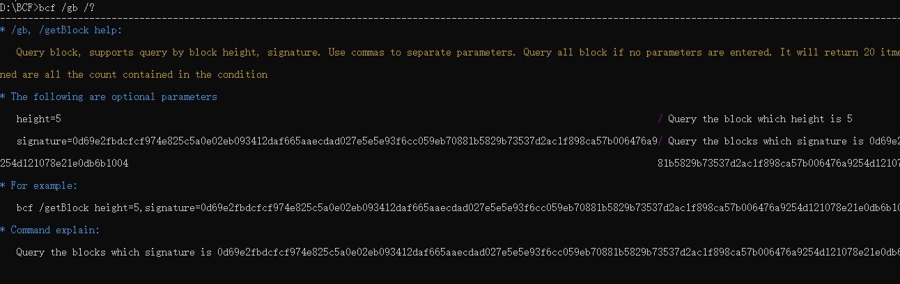
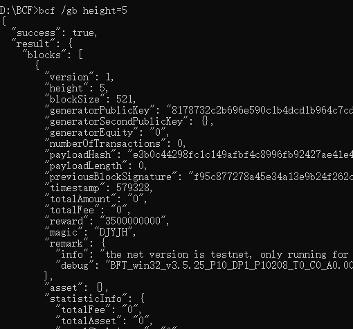
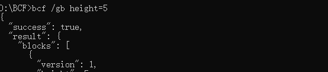

# 命令行工具

## 获取命令行工具的帮助信息

输入命令“bcf /?” 或“bcf /help” 获取BCF命令行帮助说明(Linux下为“ bcf –h”或“bcf
--help”下为“bcf /?” 或“bcf /help”，下述以Windows为例)， 详细命令列表如下：

| **命令简写** | **完整命令**             | **接口命令功能描述**             |
|--------------|--------------------------|----------------------------------|
| /h           | /help                    | bcf 命令行工具使用帮助           |
| /v           | /version                 | 查看版本信息                     |
| /sp          | /setpassword             | 设置命令行执行密码               |
| /glb         | /getLastblock            | 获取最新区块                     |
| /gb          | /getBlock                | 获取指定区块                     |
| /gt          | /getTransactions         | 获取指定事件                     |
| /ga          | /getAccountInfoAndAssets | 通过地址获取账户信息             |
| /ca          | /createAccount           | 创建账户                         |
| /gci         | /getConfigInfo           | 查看节点参数信息                 |
| /gbc         | /getBlockChainStatus     | 查看节点状态                     |
| /tta         | /trTransferAsset         | 发送权益转移事件                 |
| /tsi         | /trSignature             | 发送设置安全密码事件             |
| /tusr        | /trUsername              | 发送地址命名事件                 |
| /tdeg        | /trDelegate              | 发送注册锻造者事件               |
| /tav         | /trAcceptVote            | 发送接受投票事件                 |
| /trv         | /trRejectVote            | 发送拒绝投票事件                 |
| /tv          | /trVote                  | 发送治理投票事件                 |
| /tda         | /trDapp                  | 发送创建DAPPID事件               |
| /tdap        | /trDappPurchasing        | 发送DAPPID付费事件               |
| /tmr         | /trMark                  | 发送数据存证事件                 |
| /tia         | /trIssueAsset            | 发送权益发行事件                 |
| /tdya        | /trDestoryAsset          | 发送销毁权益事件                 |
| /ttea        | /trToExchangeAsset       | 发送权益交换事件                 |
| /tbea        | /trBeExchangeAsset       | 发送接受权益交换事件             |
| /ttesa       | /trToExchangeSpecAsset   | 发送资产交换事件                 |
| /tbesa       | /trBeExchangeSpecAsset   | 发送接受资产交换事件             |
| /tga         | /trGiftAsset             | 发送权益赠与事件(红包事件)       |
| /tgra        | /trGrabAsset             | 发送接受权益赠与事件(抢红包事件) |
| /ttra        | /trTrustAsset            | 发送委托权益事件                 |
| /tsfa        | /trSignForAsset          | 发送签收委托权益事件             |
| /tln         | /trLocationName          | 发送注册、注销位名系统事件       |
| /tslm        | /trSetLnsManager         | 发送设置位名系统管理员事件       |
| /tslns       | /trSetLnsRecordValue     | 发送设置位名系统解析值事件       |
| /mmi         | /miningMachineInfo       | 节点信息                         |
| /sfc         | /safetyClose             | 安全关闭节点                     |
| /ssk         | /setSystemKey            | 设置节点密码                     |
| /vfs         | /verifySystemKey         | 验证节点密码                     |
| /asa         | /addSystemAdmin          | 增加节点管理员                   |
| /ssd         | /setSystemDelegate       | 设置节点受托人                   |
| /ssd         | /getSystemDelegate       | 获得节点受托人                   |
| /gsa         | /getSystemAdmin          | 获得节点管理员                   |
| /ssc         | /setSystemConfig         | 设置节点配置信息                 |
| /grs         | /getRuntimeState         | 设置节点状态（实时信息）         |
| /gsm         | /getSystemMonitor        | 获得节点访问统计信息             |
| /glt         | /getSystemLoggerType     | 获得节点运行日志类型             |
| /gll         | /getSystemLoggerList     | 获得节点运行日志列表             |
| /gld         | /getSystemLoggerDetail   | 获得节点运行日志内容             |
| /gsci        | /getSystemConfigInfo     | 获得节点配置信息                 |
| /gea         | /getEmailAddress         | 获得节点邮箱地址                 |
| /sea         | /setEmailAddress         | 设置节点邮箱地址                 |
| /vsa         | /verifySystemAdmin       | 验证节点管理员                   |
| /vss         | /verifySystemSecret      | 通过节点私钥验证节点受托人       |
| /swl         | /setSystemWhiteList      | 设置节点白名单                   |
| /gwl         | /getSystemWhiteList      | 获得节点白名单                   |
| /dwl         | /delSystemWhiteList      | 删除节点白名单                   |
| /gpn         | /getProcessNetwork       | 获得节点进程网络信息             |
| /gpc         | /getProcessCPU           | 获得节点进程                     |
| /gpm         | /getProcessMemory        | 获得节点进程内存信息             |
| /dsa         | /delSystemAdmin          | 删除节点管理员                   |
| /ess         | /systemStatus            | 定时发送节点状态                 |
| /esp         | /systemProcess           | 定时发送节点                     |

说明：

1.  对于单一指令：可输入“/?” 查看指令帮助信息详情，如 “bcf /glb
    /?”查看获取最新区块命令的帮助信息详情;

2.  对于命令组合：如需查看多个命令的帮助信息， 可直接输入多个命令 后面加上 “/?”
    例如 “bcf /glb /gb /?”

-   注： 在没有输入“/?”的情况下，只有 /sp(/setpassword) 可与其他命令进行组合，
    例如 bcf /glb /sp 123 表示设置命令行执行密码为 123 并获取最新高度。如果是
    bcf /glb /gb 的组合将是不合法的。

1.  帮助信息如下图所示

1.  查询某个命令的帮助信息

    以 “/gb” 为例 输入 “bcf /gb /?” 可获取帮助信息

## 命令行调用示例

由上图的帮助信息得知，需要根据高度查询区块可输入”bcf /gb height=5” 查询高度为 5
的区块，返回如下:

## 返回参数说明

返回参数包含两部分内容：

1.  调用成功/失败标志：

    返回参数中的第一个参数success，标志调用的结果是成功或失败。

    1.  如果调用结果成功，则返回success:true

1.  如果调用结果失败，则返回success:false，同时返回错误信息：

1.  执行结果

    返回参数中的第二个参数为执行结果。 命令行分为2种：查询命令行和设置命令行：

    1.  执行查询操作的命令在执行成功时，返回结果如下：

1.  执行配置操作的命令在执行成功时，返回结果一般为：

