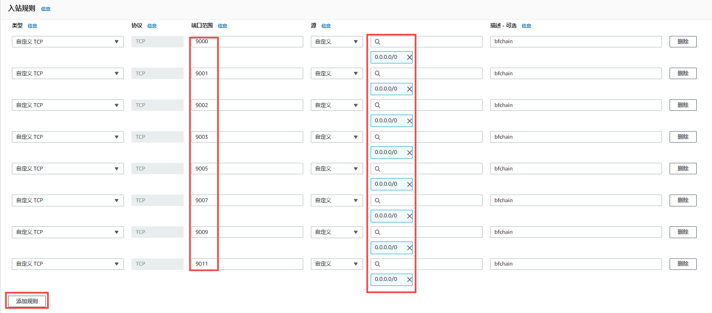

# 节点部署

## 准备

- 禁用SELinux

  ```
  sed -i 's/SELINUX=enforcing/SELINUX=disabled/g' /etc/selinux/config
  
  ```

- 安装软件包
  
  ```
  yum install -y zip unzip ntp epel-release

  ```
  
- 同步网络时间

  ```
  ntpdate -u cn.pool.ntp.org

  #添加定时任务每天凌晨3点自动同步时间
  echo  "0 3 * * * /usr/sbin/ntpdate -u cn.pool.ntp.org ;/usr/sbin/hwclock -w" >>/var/spool/cron/root
  ```
  
- 安装相关依赖

  ```
  rpm -ivh https://mirrors.aliyun.com/centos-vault/8.0.1905/BaseOS/x86_64/os/Packages/crypto-policies-20181217-6.git9a35207.el8.noarch.rpm
  rpm -ivh --replacefiles https://mirrors.aliyun.com/centos-vault/8.1.1911/BaseOS/x86_64/os/Packages/openssl-libs-1.1.1c-2.el8_1.1.x86_64.rpm
  rpm -ivh --replacefiles https://mirrors.aliyun.com/centos-vault/8.1.1911/BaseOS/x86_64/os/Packages/openssl-1.1.1c-2.el8_1.1.x86_64.rpm
  rpm -ivh https://mirrors.aliyun.com/centos-vault/7.0.1406/os/x86_64/Packages/libevent-2.0.21-4.el7.x86_64.rpm
  yum install -y supervisor
  
  ```

- 调整用户可以使用的最大文件数：

  ```
  echo -ne "
    * soft nofile 65536
    * hard nofile 65536
  " >> /etc/security/limits.conf
  ```

  

- 内核参数优化

  ```
  echo -ne "
    net.ipv4.tcp_max_tw_buckets=10000
    net.ipv4.tcp_sack=1
    net.ipv4.tcp_window_scaling=1
    net.ipv4.tcp_rmem=4096 87380 4194304
    net.ipv4.tcp_wmem=4096 16384 4194304
    net.ipv4.tcp_max_syn_backlog=65536
    net.core.netdev_max_backlog=65536
    net.core.somaxconn=32768
    net.core.wmem_default=8388608
    net.core.rmem_default=8388608
    net.core.wmem_max=16777216
    net.core.rmem_max=16777216
    net.ipv4.tcp_synack_retries=2
    net.ipv4.tcp_syn_retries=2
    net.ipv4.tcp_tw_recycle=1
    net.ipv4.tcp_tw_reuse=1
    net.ipv4.tcp_keepalive_time=1200
    net.ipv4.tcp_mem=94500000 915000000 927000000
    net.ipv4.tcp_max_orphans=3276800
    net.ipv4.ip_local_port_range=9000 65000
    vm.swappiness=0
    net.ipv4.tcp_fin_timeout=15
    fs.file-max=1048576
  " >> /etc/sysctl.conf
  
  ```

 

- 使用jemalloc优化内存占用 
  为达到内存使用最优化，可以使用jemalloc 替代系统 glibc malloc，方法如下：
  centos7（配置后需要重启服务器）:

  ```
  rpm -ivh https://cbs.centos.org/kojifiles/packages/jemalloc/3.6.0/8.el7.centos/x86_64/jemalloc-3.6.0-8.el7.centos.x86_64.rpm
  rpm -ivh https://cbs.centos.org/kojifiles/packages/jemalloc/3.6.0/8.el7.centos/x86_64/jemalloc-devel-3.6.0-8.el7.centos.x86_64.rpm
  echo "/usr/lib64/libjemalloc.so" >> /etc/ld.so.preload
  
  ```

  

 

## 公有链节点部署

### 节点程序安装与配置

为了确保您能顺利运行生物链林PC节点程序 - BCF，我们推荐您使用以下配置的设备： 

  CPU：16核（主频3.0G+）

  内存：16G

  硬盘：SSD 1T以上

  系统：CentOS 7.*


- 节点程序及升级服务程序安装与配置步骤如下：   

1. 为BFMeta创建一个目录

   ```
   mkdir -p /data
   ```

   

2. 上传BFMeta.zip文件(压缩文件内含有BFMeta程序及升级服务程序)并解压至/data目录

   ```
   unzip -o -q /data/release/BFMeta.zip -d /data/
   
   ```

   

3. 授予文件可执行权限

   ```
   chmod u+x /data/BFMeta/bcf
   chmod u+x /data/BFMeta/mongoComponents/linux/mongo*
   chmod u+x /data/BFMeta/turnserver/bin/turnserver
   chmod u+x /data/upgrade/mongoComponents/linux/mongo*
   chmod u+x /data/upgrade/upgrade
   echo "export BCF_HOME=/data/BFMeta"  >> /etc/profile
   #生效环境变量
   source  /etc/profile 
   ```

   

4. 配置supervisor(管理后台运行BFMeta及升级服务进程)

   ```
   echo -ne "
   	[program:bcf]	
   	command=/data/BFMeta/bcf  ; 
   	directory=/data/BFMeta
   	autostart=true    ; 
   	user=root      ;
   	autorestart=unexpected   ;
   	exitcode=0,2   ;
   	startretries=3    ;
   	priority=999     ;
   	redirect_stderr=true ;
   	stdout_logfile_maxbytes=50MB  ;
   	stdout_logfile_backups = 20  ;
   	stdout_logfile=/data/BFMeta/logs/bcf.log    ;
   	stopasgroup=true   ;
   " >> /etc/supervisord.d/bcf.ini
   
   echo -ne "
   	[program:upgrade]
   	command=/data/upgrade/upgrade  ; 
   	directory=/data/upgrade
   	autostart=true       ; 
   	user=root           ;
   	autorestart=unexpected    ;
   	exitcode=0,2    ;
   	startretries=3       ;
   	priority=999         ;
   	redirect_stderr=true ;
   	stdout_logfile_maxbytes=50MB  ;
   	stdout_logfile_backups = 20   ;
   	stdout_logfile=/data/upgrade/logs/console.log      ;
   	stopasgroup=true     ;
   " >> /etc/supervisord.d/upgrade.ini
   ```

### 防火墙配置 

1. 系统防火墙策略
   
   - firewalld
   
   ```
   允许所有的外部ip访问：
   firewall-cmd  --add-port=9000/tcp  --add-port=9001/tcp --add-port=9002/tcp --add-port=9003/tcp --add-port=9005/tcp --add-port=9007/tcp  --add-port=9009/tcp --add-port=9011/tcp --permanent
   
   允许外部ip(如1.1.1.1/32)访问：
   firewall-cmd --permanent --add-rich-rule="rule family="ipv4" source address="1.1.1.1/32" port port="9000" protocol="tcp" accept"
   firewall-cmd --permanent --add-rich-rule="rule family="ipv4" source address="1.1.1.1/32" port port="9001" protocol="tcp" accept"
   firewall-cmd --permanent --add-rich-rule="rule family="ipv4" source address="1.1.1.1/32" port port="9002" protocol="tcp" accept"
   firewall-cmd --permanent --add-rich-rule="rule family="ipv4" source address="1.1.1.1/32" port port="9003" protocol="tcp" accept"
   firewall-cmd --permanent --add-rich-rule="rule family="ipv4" source address="1.1.1.1/32" port port="9005" protocol="tcp" accept"
   firewall-cmd --permanent --add-rich-rule="rule family="ipv4" source address="1.1.1.1/32" port port="9007" protocol="tcp" accept"
   firewall-cmd --permanent --add-rich-rule="rule family="ipv4" source address="1.1.1.1/32" port port="9009" protocol="tcp" accept"
   firewall-cmd --permanent --add-rich-rule="rule family="ipv4" source address="1.1.1.1/32" port port="9011" protocol="tcp" accept"
   
   ```
   
   iptable
   
   ```
   允许所有的外部ip访问：
   iptables -A INPUT -p tcp -m multiport --dport 9000:9003,9005,9007,9009,9011 -m state --state NEW,ESTABLISHED  -j ACCEPT
   
   允许外部ip(如1.1.1.1/32)访问：
   iptables -A INPUT -p tcp -m multiport --dport 9000:9003,9005,9007,9009,9011 -m state --state NEW,ESTABLISHED -s 1.1.1.1/32  -j ACCEPT
   
   ```
   
   
   
2. 云平台防火策略
   节点程序部署在云服务器上，需根据云服务商操作文档开放防火墙入站规则。

   - 谷歌云：

     ```
     1、转到 Google Cloud Console 中的“防火墙”(网络---VPC网络--防火墙)页面。
     2、点击创建防火墙规则。
     3、输入防火墙规则的名称。 该名称在项目中必须是唯一的。
     4、指定要实行防火墙规则的网络。
     5、指定规则的优先级。
     6、选择入站作为流量方向。
     7、对于对匹配项执行的操作，选择允许。
     8、对于目标，请执行以下操作之一：
     	如果要允许从 bfchain节点 实例到网络中所有客户端的流量，请选择网络中的所有实例。
     	如果要允许来自 bfchain节点 实例的特定客户端的流量，请选择指定的目标标记。在目标标记中输入客户端的实例名称。
     9、保留来源过滤条件的 IP 地址范围的默认值。
     10、对于来源 IP 地址范围，输入要允许作为访问来源的 bfchain节点 实例的 IP 地址范围。
     	可以输入 0.0.0.0/0以允许所有的ip地址访问流量通过，也可以输入特定的IP地址限定只允许该ip地址访问（必须使用 CIDR 表示法）。
     11、保留次要来源过滤条件的默认值无。
     12、对于协议和端口，请选择指定的协议和端口，然后：
     	选中 tcp 复选框并在关联字段中输入 9000,9001,9002,9003,9005,9007,9009,9011 。
     13、选择创建。
     ```

     a)后端所有云服务器开放端口允许所有ip地址访问：
     

     b)后端所有云服务器开放端口允许特点ip地址(如1.1.1.1)访问：
     

     c)后端特定标签（如bfchainnode）的云服务器开放端口允许所有ip地址访问：
     

     d)后端特定标签（如bfchainnode）的云服务器开放端口允许特点ip地址(如1.1.1.1)访问：

     
     

   

   ​	

   - AWS：

     1. 点击需要配置的实例明细 “安全”--“安全组”：
        

     2. 然后在弹出的安全组点击“编辑安全组规则”：
        

     3. 添加入站规则：

        

     

   - 阿里云:

     1. 登录到ECS云服务器控制台
        看不到ECS实例，可以切换地域查找，找到需要操作的目标实例。

     2. 在实例列表中，点击“更多”--“网络和安全组”--“安全组配置”
        

     3. 打开安全组配置界面，点击“配置规则”
        

     4. 安全组访问规则配置(手动添加规则)
        安全组规则中的访问规则有两个方面，即入方向和出方向，入方向是指用户访问服务器的方向，出方向是指云服务器向外访问一般不做限制。

        

   

   
   
   
### 启动服务   

1. 启动BFMeta节点程序 - BCF

   ```
   systemctl enable supervisord
   systemctl start supervisord
   
   ```


## 私有链节点部署

### 环境

|       | 配置                                                  | IP           |
| ----- | ----------------------------------------------------- | ------------ |
| Node1 | CPU：16核心 内存：16G带宽：1G SSD：1T系统：centos 7.8 | 172.30.56.61 |
| Node2 | CPU：16核心 内存：16G带宽：1G SSD：1T系统：centos 7.8 | 172.30.56.62 |
| Node3 | CPU：16核心 内存：16G带宽：1G SSD：1T系统：centos 7.8 | 172.30.56.63 |


### 节点程序安装与配置

> 请确保您的设备已经安装恰当的依赖环境。

1. 创建BFMeta目录

   ```
   mkdir -p  /data/BFMeta/
   ```

2. 下载release版的方式获取BFMeta完整安装包（BFMeta.zip）。
   
3. 将BFMeta.zip解压至/data/BFMeta目录

   ```
   unzip -o -q /data/release/BFMeta.zip -d /data/BFMeta
   ```

4. 授予文件可执行权限

   ```
   chmod u+x /data/BFMeta/bcf
   chmod u+x /data/BFMeta/mongoComponents/linux/mongo*
   chmod u+x /data/BFMeta/turnserver/bin/turnserver
   echo "export BCF_HOME=/data/BFMeta"  >> /etc/profile
   #生效环境变量
   source  /etc/profile 
   ```

5. 配置文件

   - 下载创世块
      向BFMeta团队购买创世块，并将文件放入 /data/BFMeta/genesisInfos 目录中
     
   - 修改配置文件(/data/BFMeta/conf/base-config.json)
     
     ​	配置外部引入创世块 isGenesisInfoProvideExternally为true 
     ​	配置正式网络或测试网络bnid为b或c 
     ​	配置所导入的创世链链名chainName
     ​	配置所导入的创世块的区块链资产名chainAssetType
     ​	配置所导入的创世块的magic chainMagic
     
   - 配置节点IP
     修改配置文件/data/BFMeta/conf/bft-config-mainnet.json 中的 peers字段，添加初始连接的ip
     
      
     
   
6. 配置supervisor(管理后台运行BFMeta进程)

   ```
   echo -ne "
   	[program:bcf]
   	command=/data/BFMeta/bcf  ; 
   	directory=/data/BFMeta
   	autostart=true    ; 
   	user=root      ;
   	autorestart=unexpected   ;
   	exitcode=0,2   ;
   	startretries=3    ;
   	priority=999     ;
   	redirect_stderr=true ;
   	stdout_logfile_maxbytes=50MB  ;
   	stdout_logfile_backups = 20  ;
   	stdout_logfile=/data/BFMeta/logs/bcf.log    ;
   	stopasgroup=true   ;
   " >> /etc/supervisord.d/bcf.ini
   ```


### 防火墙配置   

1. 系统防火墙策略(仅开放3台节点互联)

   FIREWALLD:

   ```
   firewall-cmd --permanent --add-rich-rule="rule family="ipv4" source address="172.30.56.61" port port="9000" protocol="tcp" accept"
   firewall-cmd --permanent --add-rich-rule="rule family="ipv4" source address="172.30.56.61" port port="9001" protocol="tcp" accept"
   firewall-cmd --permanent --add-rich-rule="rule family="ipv4" source address="172.30.56.61" port port="9002" protocol="tcp" accept"
   firewall-cmd --permanent --add-rich-rule="rule family="ipv4" source address="172.30.56.61" port port="9003" protocol="tcp" accept"
   firewall-cmd --permanent --add-rich-rule="rule family="ipv4" source address="172.30.56.61" port port="9005" protocol="tcp" accept"
   firewall-cmd --permanent --add-rich-rule="rule family="ipv4" source address="172.30.56.61" port port="9007" protocol="tcp" accept"
   firewall-cmd --permanent --add-rich-rule="rule family="ipv4" source address="172.30.56.61" port port="9009" protocol="tcp" accept"
   firewall-cmd --permanent --add-rich-rule="rule family="ipv4" source address="172.30.56.61" port port="9011" protocol="tcp" accept"
   firewall-cmd --permanent --add-rich-rule="rule family="ipv4" source address="172.30.56.62" port port="9000" protocol="tcp" accept"
   firewall-cmd --permanent --add-rich-rule="rule family="ipv4" source address="172.30.56.62" port port="9001" protocol="tcp" accept"
   firewall-cmd --permanent --add-rich-rule="rule family="ipv4" source address="172.30.56.62" port port="9002" protocol="tcp" accept"
   firewall-cmd --permanent --add-rich-rule="rule family="ipv4" source address="172.30.56.62" port port="9003" protocol="tcp" accept"
   firewall-cmd --permanent --add-rich-rule="rule family="ipv4" source address="172.30.56.62" port port="9005" protocol="tcp" accept"
   firewall-cmd --permanent --add-rich-rule="rule family="ipv4" source address="172.30.56.62" port port="9007" protocol="tcp" accept"
   firewall-cmd --permanent --add-rich-rule="rule family="ipv4" source address="172.30.56.62" port port="9009" protocol="tcp" accept"
   firewall-cmd --permanent --add-rich-rule="rule family="ipv4" source address="172.30.56.62" port port="9011" protocol="tcp" accept"
   firewall-cmd --permanent --add-rich-rule="rule family="ipv4" source address="172.30.56.63" port port="9000" protocol="tcp" accept"
   firewall-cmd --permanent --add-rich-rule="rule family="ipv4" source address="172.30.56.63" port port="9001" protocol="tcp" accept"
   firewall-cmd --permanent --add-rich-rule="rule family="ipv4" source address="172.30.56.63" port port="9002" protocol="tcp" accept"
   firewall-cmd --permanent --add-rich-rule="rule family="ipv4" source address="172.30.56.63" port port="9003" protocol="tcp" accept"
   firewall-cmd --permanent --add-rich-rule="rule family="ipv4" source address="172.30.56.63" port port="9005" protocol="tcp" accept"
   firewall-cmd --permanent --add-rich-rule="rule family="ipv4" source address="172.30.56.63" port port="9007" protocol="tcp" accept"
   firewall-cmd --permanent --add-rich-rule="rule family="ipv4" source address="172.30.56.63" port port="9009" protocol="tcp" accept"
   firewall-cmd --permanent --add-rich-rule="rule family="ipv4" source address="172.30.56.63" port port="9011" protocol="tcp" accept"
   
   ```

   iptables:

   ```
   iptables -A INPUT -p tcp -m multiport --dport 9000:9003,9005,9007,9009,9011 -m state --state NEW,ESTABLISHED -s 172.30.56.61,172.30.56.62,172.30.56.63  -j ACCEPT
   ```


### 启动服务   

1. 启动BFMeta节点程序 - BCF

   ```
   systemctl enable supervisord
   systemctl start supervisord 
   
   ```