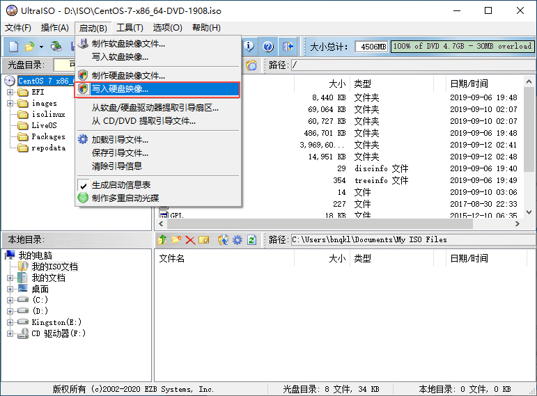
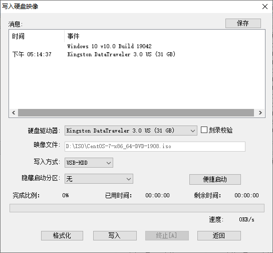
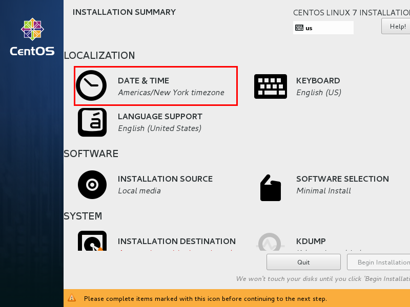
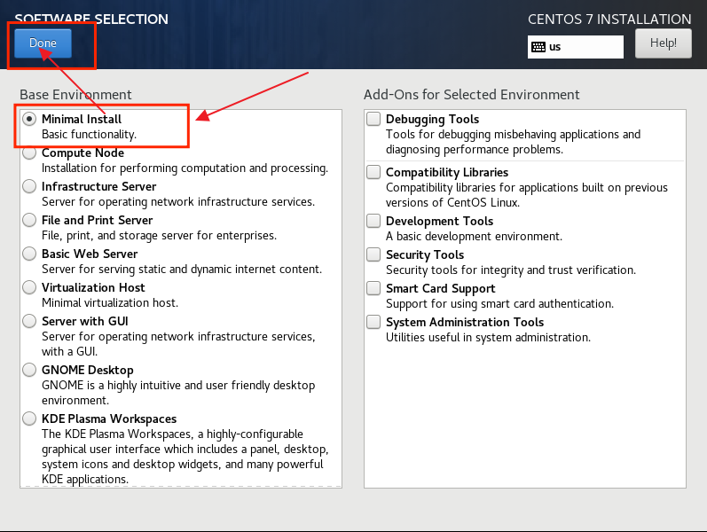
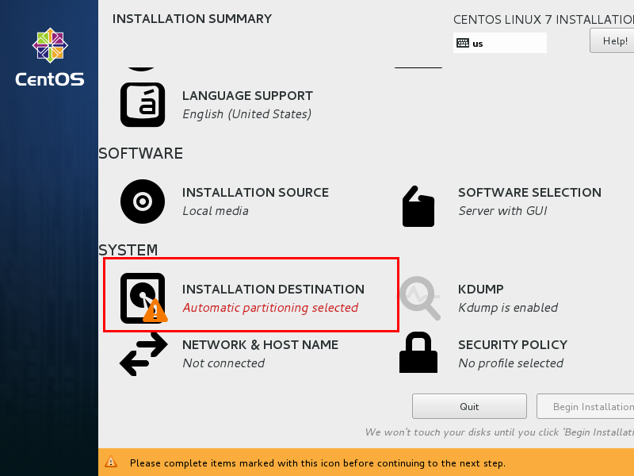
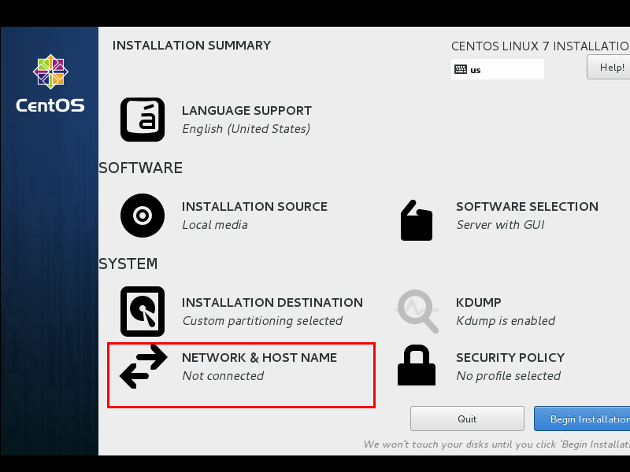
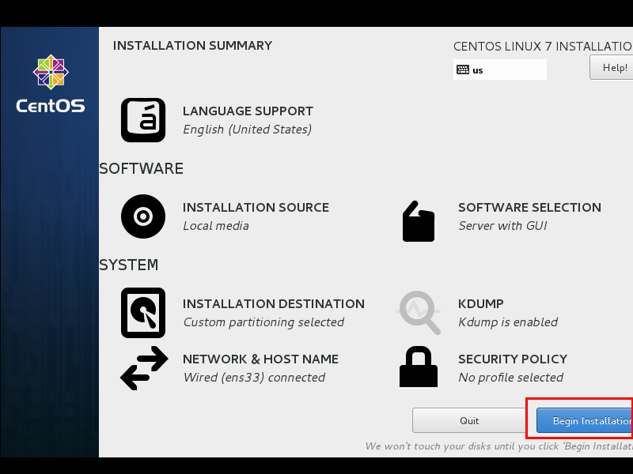
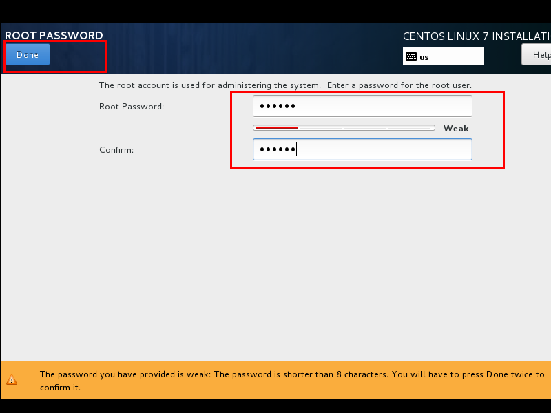
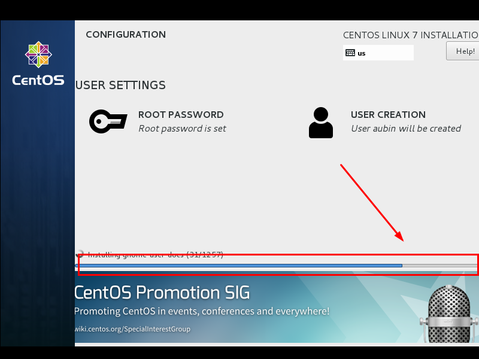

# 搭建Linux环境

## 制作U盘启动盘（安装盘）

1. 使用UltraISO工具： 文件 -> 打开 选择ISO文件(centos的iso安装文件)
   

2. 依次点击菜单：启动 -> 写入硬盘映像

   
   

   
   
3. 选择相应的U盘，点击写入，就制作好了U盘安装盘。
   

## 安装Linux系统

将制作好的U盘插入要安装系统的电脑，并设置BIOS的启动项为从U盘启动。启动后就进入了安装界面。

1.开机引导从U盘启动后会出现以下界面:

   - Install CentOS 7 安装CentOS 7
   - Test this media & install CentOS 7 测试安装文件并安装CentOS 7
   - Troubleshooting 修复故障

   选择第一项，安装直接CentOS 7，回车，进入下面的界面
   
2.选择第一项，安装直接CentOS 7，回车，进入下面的界面

   
   

3.选择安装过程中使用的语言，这里选择英文、键盘选择美式键盘。点击Continue
   

4.首先设置时间
   

5.时区选择上海，查看时间是否正确。然后点击Done
   

6.选择需要安装的软件
   

7.选择Minimal Install，然后点击Done
   

8.选择安装位置，在这里可以进行磁盘划分。
   

9.选择i wil configure partitioning（我将会配置分区），然后点击done
   

10.如下图所示，点击加号，选择/boot，给boot分区分400M。最后点击Add
    

11.然后以同样的办法给其他三个区分配好空间后点击Done
    

12.然后会弹出摘要信息，点击AcceptChanges(接受更改)
    

::: tip
<pre>

关于如何设置分区大小的建议：
一般来说，在linux系统中都有最少两个挂载点，分别是/ (根目录)及 swap（交换分区），其中，/ 是必须的；
建议一般挂载的几大目录和大小：
   /swap	目录  32G  # 内存小于4G的为内存的2倍  内存大于4G的和内存大小一致即可
   /boot	目录  400M # boot loader 的静态链接文件，存放与Linux启动相关的程序
   /	(根)目录   # 剩下全部    
</pre>
:::

13.设置主机名与网卡信息
    

14.首先要打开网卡，然后查看是否能获取到IP地址，再更改主机名后点击Done。
    

15.最后选择Begin Installation(开始安装)
    

16.设置root密码
    

17.设置root密码后点击Done
    

18.等待系统安装完毕重启系统即可
    

    
