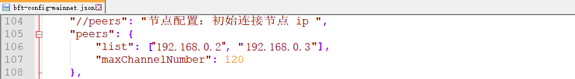

# 节点部署

本章将介绍如何进行节点的部署，包括节点部署、链的部署等。

## 部署方式

### 单节点部署

按照下列步骤即可部署单节点：

1. 在单节点上安装生物链林BCF节点软件；
   
   按照本文第3章的操作说明完成BCF安装配置，配置成功之后双击BCF可运行节点。
   
2. 切换节点网络环境：请参考[\<配置网络环境\>](/zh/教程/PC全节点教程/Windows/install.html#配置网络环境)；

3. 切换节点运行的链：请参考[\<配置节点运行的链\>](/zh/教程/PC全节点教程/Windows/install.html#配置节点运行的链)；

4. 节点身份绑定：请参考[\<节点身份绑定\>](/zh/教程/PC全节点教程/Windows/install.html#节点身份绑定)。

以上操作成功之后，就能实现单节点部署。

下文将以部署三个节点为例，说明如何在多台节点上部署同一条链的生物链林BCF节点软件。

#### 安装

在三个不同节点（节点IP分别为`192.168.0.1`，`192.168.0.2`，`192.168.0.3`）上按照手册中的安装步骤分别安装BCF。安装成功之后双击BCF可运行节点。

#### 配置

多节点之间要实现节点同步，要配置节点同步IP列表，在节点启动后会自动与列表中的节点连接。具体操作方式如下：

1. 切换节点网络环境：请参考[\<配置网络环境\>](/zh/教程/PC全节点教程/Windows/install.html#配置网络环境)；

2. 切换节点运行的链：请参考[\<配置节点运行的链\>](/zh/教程/PC全节点教程/Windows/install.html#配置节点运行的链)；

3. 添加待同步的节点IP(假设用户配置的是正式网络)：
   
   配置文件路径：`/安装目录/conf/bft-config-mainnet.json`(若用户配置的是测试网络，则修改`bft-config-testnet.json`文件)。在peers的list中配置需要连接的节点ip，这样在运行时会自动与该节点同步。
   
   例如本节点(`192.168.0.1`)需要同步的其他2个节点（`192.168.0.2`，`192.168.0.3`），可按照下图进行配置。
   
   

4. 节点身份绑定：请参考[\<节点身份绑定\>](/zh/教程/PC全节点教程/Windows/install.html#节点身份绑定)。

> 注1：部署三个节点，所以每轮至少需要3个区块，至少这里需要设置3个受托人。我们推荐每轮57个区块，114个受托人；

> 注2：创世块可以由一台节点创建，然后将创世块拷贝到节点安装目录的`genesisInfos`文件夹下，并且按照上述步骤修改配置文件方可运行；

> 注3：运行非BFChain的链需要向生物链林团队申请创世块，详情请见\<[创世块申请](/zh/教程/PC全节点教程/Windows/install.html#创世块申请)\>。

#### 运行

完成以上配置后，即可实现多节点部署。

### 多条链部署

用户如果想在某节点上部署生物链林数据中心版多条链，例如用户想部署BFChain和另一条链FINChain，可按照下列操作步骤执行：

1. 用户下载安装生物链林数据中心版(BCF)，并按照上文\<[单节点部署](/zh/教程/PC全节点教程/Windows/deploy.html#单节点部署)\>方式修改配置文件，启动则部署BFChain成功。

2. 根据\<[配置节点运行的链](/zh/教程/PC全节点教程/Windows/install.html#配置节点运行的链)\>，切换为FINChain的创世块运行，并检查相应的配置文件。配置文件路径：`/安装目录/conf/“链名”-config-“网络类型”.json`。
   
   例如：链名= “fin”, 网络类型 = `mainnet`(正式网络: `mainnet`; 测试网络:`testnet`)。则FINChain的正式网络路径如下：`/安装目录/conf/fin-config-mainnet.json`。

3. 用户如果部署另外的链，可按照步骤2进行操作。

## 组网模式

### 公有链部署

1. 若想运行BFChain公有链节点的正式网络，则按照\<[单节点部署](/zh/教程/PC全节点教程/Windows/deploy.html#单节点部署)\>步骤，将配置文件`/安装目录/conf/base-config.json`中的参数：
   
   1. “`isGenesisBlockProvidedExternally`”设置为`false`
   
   2. “`bnid`”设置为`b`

2. 若想运行的是BFChain公有链节点的测试网络，则
   
   1. “`isGenesisBlockProvidedExternally`”设置为`false`
   
   2. “`bnid`”设置为`c`

### 联盟链部署

1. 需要联系生物链林团队申请联盟链的创世块。

2. 联盟链的准入权限在部署网络时管理，区块链上不管理接入权限。

3. 按照\<[单节点部署](/zh/教程/PC全节点教程/Windows/deploy.html#单节点部署)\>步骤使用联盟链创世块部署节点。

4. 按照\<[多节点部署](/zh/教程/PC全节点教程/Windows/deploy.html#多节点部署)\>配置节点连接的IP，可实现各节点的同步。

5. 机构之间独自管理各个节点的\<[配置数据库的用户名和密码](/zh/教程/PC全节点教程/Windows/install.html#配置数据库的用户名和密码)\>

### 私有链部署

1. 需要联系生物链林团队申请私有链的创世块。

2. 按照\<[单节点部署](/zh/教程/PC全节点教程/Windows/deploy.html#单节点部署)\>步骤使用私有链创世块部署节点，这样运行节点时则可以启动私有链。

3. 按照\<[多节点部署](/zh/教程/PC全节点教程/Windows/deploy.html#多节点部署)\>配置节点连接的IP，可实现各节点的同步。

4. 在私有链上重置区块链。见\<[区块链数据重置](/zh/教程/PC全节点教程/Windows/faq.html#区块链数据重置)\>。如果有多个节点，需要在每个节点上都重置。

