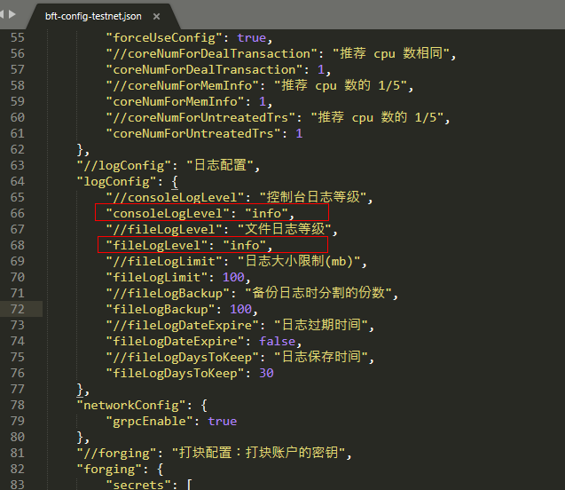
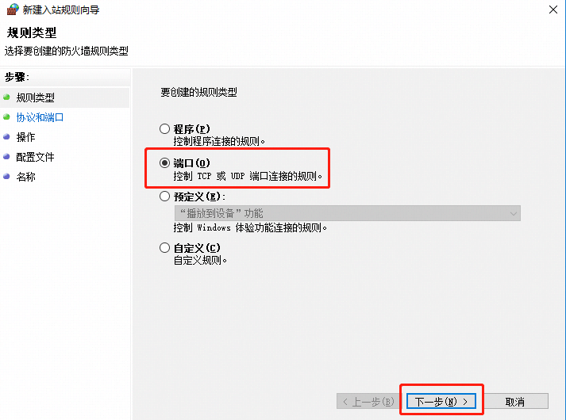
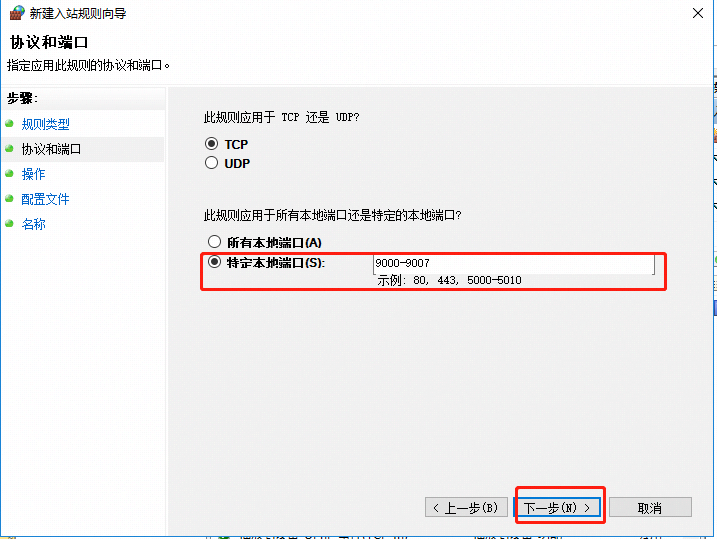
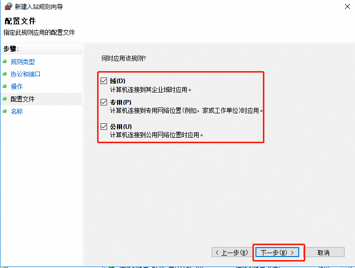
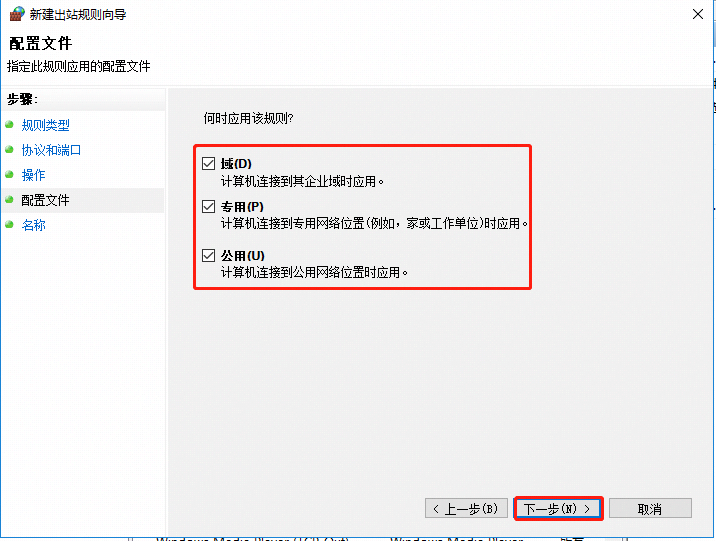
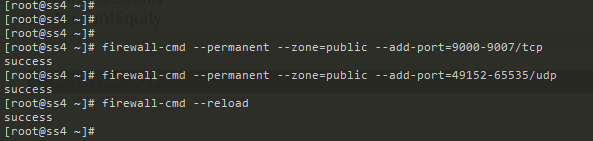

# 常见问题整理

本章将介绍在使用生物链林数据中心版BCF.exe时可能遇到的常见问题的解决方案。若您遇到了本章中未列出的问题时，请与生物链林BCF团队(邮箱地址：service@bfchain.org)联系以获得更多的支持。

## 节点运行时产生的数据

下列文件夹下的数据都是重要数据，详细信息如下：

1. `chaindata`文件夹: `chaindata`保存了当前节点区块链的所有数据。

2. `logs`文件夹: `logs`保存了当前节点的运行日志，日志文件说明请参考名词解释\<[日志文件名及内容说明](/zh/教程/PC全节点教程/Windows/glossary.md#日志文件名及内容说明)\>。

3. `backup`文件夹: `backup`保存了关键检查点的数据，用于快速启动或恢复节点，若这个文件夹中的数据丢失，节点依然可以正常启动，只是需要消耗更多时间重建区块链。

## 区块链数据重置

用户如果想重置区块链，可以删除目录`chaindata`及该目录下的所有文件。

## 开机自动运行

如果想在节点启动时就自动运行BCF.exe，有下列方式。

1. 在开始菜单的启动文件夹下添加BCF.exe图标
   
   1. 找到`StartMenu\\Programs\\Startup`路径(路径取决于用户电脑设置的位置，例如C盘下的自启动文件路径为为：`C:\\username\\Microsoft\\Windows\\Start Menu\\Programs\\Startup`)，复制路径
   
   2. 运行（`win+R键`），然后粘贴步骤1)复制的路径至输入框内，并按回车。
   
   
   
   1. 进入开始菜单的自启动文件夹
   
   
   
   1. 返回桌面，找到BCF.exe图标，单击鼠标右键，选择“复制”BCF.exe图标
   
   
   
   1. 将复制的BCF.exe图标黏贴到第3步的自启动文件夹下，则完成开机自动运行的配置
   
   

## 设置节点日志等级

用户如果想要变更在`logs`下日志文件所显示的日志等级，可以在节点设置日志等级，具体步骤如下：

1. 在启动BCF.exe前修改配置文件，配置文件路径：`/安装目录/conf/bft-config-testnet.json`。修改参数`consoleLogLevel`与`fileLogLevel`都可以实现调整控制台输出与文件输出的日志模式的功能。



1. 日志等级分为3种：
   
   1. `info`: 信息模式，提供最有效的信息提示，使用户清楚了解到节点目前的运行状态以及运行的流程；
   
   2. `warn`: 警告模式，将不再输出信息模式下的信息，只输出警告及错误信息；
   
   3. `error`：错误模式，只输出节点运行中出错的信息。

我们推荐使用`info`模式，这样既可以了解节点运行状态，也可以捕获节点运行中出现的错误。

## 节点自动投票功能

下列介绍如何实现节点自动投票功能

1. 运行前修改配置文件实现自动投票功能
   
    修改配置文件，配置文件路径：`/安装目录/conf/`
   
   1. 正式网络配置文件\`bft-config-mainnet.json\`
   
   2. 测试网络配置文件`bft-config-testnet.json\`
      
       修改`enable`配置为`true`，保存之后运行即可以实现自动投票功能。
      
      

自动投票参数说明

| **参数名称**                 | **参数说明**           | **参数内容说明**                                                                                                                                                                                                                   |
| ------------------------ | ------------------ | ---------------------------------------------------------------------------------------------------------------------------------------------------------------------------------------------------------------------------- |
| `enable`                 | 是否启动自动投票功能         | true：启动自动投票功能 false：不启动自动投票功能                                                                                                                                                                                                |
| `useConfigFee`           | 是否使用配置文件设置的手续费     | true：使用配置文件的手续费 false：不使用配置文件的手续费                                                                                                                                                                                            |
| `fee`                    | 默认投票手续费            | 每笔投票事件的默认投票手续费                                                                                                                                                                                                               |
| `numberOfcheckTrsBlock`  | 事件确认块数             | 每笔投票事件的确认块数，超过这个数的区块没有确认投票，则不再重试本次投票                                                                                                                                                                                         |
| `maxNumberOfRecommended` | 每次选出的推荐投票人数的上限值    | 推选数量为 0-maxNumberOfRecommended 之间                                                                                                                                                                                            |
| `numberOfRounds`         | 候选推荐人的选取轮次范围       | 选取的结束高度为：如果当前轮为第一轮，则结束高度为最新区块高度，如果已经大于第一轮，则结束高度为上一轮最后一个区块；选取的起始高度：如果当前最新区块高度大于 numberOfRounds 计算出的区块数量，则起始高度为 最新区块高度 - numberOfRounds \* 每轮的区块数量，如果最新区块高度小于等于 numberOfRounds 计算出的区块数量，则 起始高度为 2（高度为 1 的区块是创世账户打包的创世块不纳入推荐列表） |
| `productivityPercent`    | 计算候选推荐人时，账户在线率占的比重 | 根据在线率排名选出的推荐人数量为：总候选人数量 \* numerator/ denominator                                                                                                                                                                            |
| `forgedBlocksPercent`    | 计算候选推荐人时，账户打块数量的比重 | 根据打块数量排名选出的推荐人数量为：总候选人数量 \* numerator/ denominator                                                                                                                                                                           |

1. 运行后修改配置文件实现自动投票功能
   
    可根据\<[设置节点配置信息](/zh/API参考/PC全节点/接口列表/1-4.md#15设置节点配置信息)\>的自动投票字段在节点运行过程中，动态调整配置信息。
    如下图所示，可开启自动投票。


## 防火墙配置

### 端口的使用

1. TCP：每一条链默认会使用一个区块链端口，对于BCF来说，正式网络为9000，测试网络为19000。除此之外，为了程序可以正常运行，建议预留该端口后十个端口以供使用，例如19000-19010。打开需要运行的链的配置文件，在文件的最上方有端口配置，若这些端口与当前节点已启动的其他程序冲突，可以自行配置。具体可参考[\<配置文件说明\>](/zh/教程/PC全节点教程/Windows/install.md#配置文件说明)的端口配置。

2. UDP：由于`stunserver`的存在，需要配置49152-65535的udp端口。

### 防火墙配置

下述说明如何配置对外开放的端口。

#### Windows

在开始菜单按照如下步骤依次点击`控制面板—\>系统与安全--\>Windows
防火墙`，进入Windows防火墙设置界面，点击界面左侧的“高级设置”。

1. 入站规则设置
   
   1. 选择入站规则然后新建规则，选择端口，然后“下一步”
      
      
      
      
   
   2. 选择TCP 选择特定端口然后输入端口，连续多个端口用`-`隔开了例如:9000-9007
      
      
      
      
   
   3. 选择允许连接
      
      
   
   4. 选择应用规则的范围
      
      
   
   5. 输入规则名称
      
      

2. 出站规则设置
   
   1. 选择入站规则然后新建规则，选择端口，然后下一步
      
      
      
      
   
   2. 选择TCP特定端口，然后输入端口，连续多个端口用“-”隔开，例如:9000-9007
      
      
   
   3. 选择允许连接
      
      
   
   4. 选择应用规则的范围
      
      
   
   5. 输入规则名称
      
      
      
      至此，开放TCP:9000-9007防火墙规则设置完毕；
   
   6. 请参考以上步骤设置开放防火墙UDP：49152-65535端口规则。

#### Linux

使用`Centos7 `自带的`firewalld`进行防火墙配置：

1. 开启9000-9007的tcp端口:
   ```shell
    firewall-cmd --permanent --zone=public --add-port=9000-9007/tcp
   ```

2. 开启49152-65535的udp端口:
   ```shell
    firewall-cmd --permanent --zone=public --add-port=49152-65535/udp
   ```

3. 刷新配置使其立即生效:
   ```shell
    firewall-cmd --reload
   ```

   

## 关于运行节点程序时，程序停止的问题

由于在Windows控制台中对文字编辑等操作，会使得程序暂时停止(此时按下"Enter"可继续运行)，建议在控制台中进行如下配置:

1. 右键控制台上方的工具条，点击“属性”
   
   

2. 关闭“快速编辑模式”的复选框，点击“确定”。
   
   

 

## 关于查看节点运行状态的问题

以下介绍几种查看节点是否正常运行的方法

1. 使用\<[获取节点状态接口](/zh/API参考/PC全节点/接口列表/1-2.md#7获取节点状态)\>，查看节点的状态。

2. 使用\<[获取本地节点当前最新区块](/zh/API参考/PC全节点/接口列表/1-2.md#2获取本地节点当前最新区块)\>，观察本节点是否能与其他节点保持一致的高度，若可以则节点运行正常。

3. 根据日志，查看打块进程的日志，搜索“error”关键字，如果没有错误，则节点正常运行。一般情况下，节点出现不可恢复的错误时，在打块进程日志中均能体现，详见\<[日志文件名及内容说明](/zh/教程/PC全节点教程/Windows/glossary.md#日志文件名及内容说明)\>。

## 常见错误

### 创世块不匹配错误

如果出现如下图所示的创世块不匹配，请检查您的创世块是否匹配，如果创世块不匹配，请重新指定您的创世块。如果您是要重新运行一条新的链，那么请卸载并删除数据目录后重新安装再使用。


