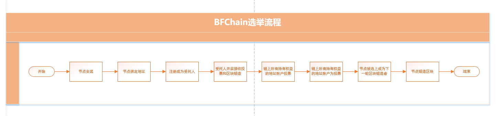

# 区块锻造者竞选

区块锻造者，指在BFChain网络中那些负责收集事件信息并将其打包到区块里的节点(即矿工)。除了具有普通节点的特性外，区块锻造者还需负责如下事务：

- 收集网络里的事件；
- 验证事件并把事件打包到区块；
- 广播区块给其他节点，通过验证后将区块添加到自己本地区块链上。

在BFChain网络中，每一轮的区块锻造者共有57个。BFChain区块锻造者是根据受托人获得的得票数及其在线率等参数综合计算推选出来的。

## 竞选流程图

流程中，区块锻造者的产生主要包含三个部分：

- 节点参与竞选
  - 成为受托人
  - 开启接收投票和区块锻造
- 持有权益的地址账户对受托人投票
- 成为锻造者
  - 进入候选区
  - 竞选成功，成为锻造者

本章主要介绍第一和第三部分，其中第二部分的投票，将在 [共识投票机制](/zh/知识库/02) 一章中描述，此章节不做详细说明。

## 成为受托人

为了提高共识效率，在BFChain区块链生态中，地址账户只要持有主链权益，即可申请成为受托人。所有地址账户均可以对已开启接收投票的受托人进行投票，系统将按照一定的算法规则从中选举出57位受托人。这57位受托人，即区块锻造者，将负责锻造下一轮的57个区块。

在BFChain生态中，主要有如下两类受托人：

1. 普通受托人：普通地址账户通过申请成为受托人
2. 创世受托人：与创世块绑定的地址受托人，目前创世受托人共114个

链上规则:

- 注册成为受托人是一种事件，需要支付一定的上链费，故只有持有主链权益的账户才可以申请成为受托人；
- 默认每轮次最多10笔“注册受托人”的事件被确认；若在该轮次中出现超过10笔以上的“注册受托人”的事件，则在被确认的10笔事件之后的事件将进入排队等待，直到下一轮区块锻造开始才可能被确认；
- 只有成为了受托人，才有可能进入候选区，这样才有机会被选中，成为锻造者；
- 支持一个节点同时绑定多个受托人。

[^注]: 当前PC端已支持一个节点可同时绑定多个受托人，BFChain移动端APP仅支持一个节点只能申请一个受托人。

BFChain生物链林提供如下事件接口，用于将节点绑定的地址账户注册成为受托人：

- 创建注册受托人事件
  - 接口全称：[trDelegate](/zh/API参考/PC全节点/接口列表/1-3#_6-创建注册受托人事件)

有关该接口的详细使用方法，请参见开发者社区相关文档。

## 接收/拒绝投票

地址账户成功申请成为受托人之后，还需要配置是否参与锻造者竞选(即，接收投票)，默认为拒绝投票。参与锻造者竞选意味着链上其他节点将有可能会投票给此受托人，则，其有可能会被选上成为区块锻造者。

需要注意的是，若受托人有幸被选中成为区块锻造者，在锻造区块时因节点未准备好(如区块高度未同步完、节点网络不稳定、节点正在升级更新中等等)，而导致无法锻造区块，则将会影响受托人接下来的竞选，大大降低后续被选中的概率。为了降低受托人的掉线率，建议在节点未准备好时，先拒绝参与锻造者竞选(即拒绝投票)，直到节点准备好了，再开启接收投票。

BFChain生物链林提供如下事件接口，用于节点配置是否参与锻造者竞选：

- 创建接收投票事件
  - 接口全称：[trAcceptVote](/zh/API参考/PC全节点/接口列表/1-3#_7-创建接收投票事件) 
- 创建拒绝投票事件
  - 接口全称：[trRejectVote](/zh/API参考/PC全节点/接口列表/1-3#_8-创建拒绝投票事件)

默认为拒绝投票

有关以上两个接口的详细使用方法，请参见开发者社区相关文档。

## 地址账户对受托人投票

投票是指，链上所有持有主链权益的地址账户，均可以在已支持的各类Dapp(如BFChain APP)或者节点程序中对受托人进行投票。受托人获得越多的节点投票，其成为锻造者的概率将越大。

BFChain生物链林提供如下事件接口，用于节点进行投票：

- 节点自动投票
  - 接口全称：setSystemConfig(设置节点配置信息)
    - JSON对象：[BFChainPC.Config.Revisable](/zh/API参考/PC全节点/接口列表/1-5#bfchainpc-config-configrevisable) 
    - JSON对象：[BFChainPC.Config.AutoVoteModel](/zh/API参考/PC全节点/接口列表/1-5#bfchainpc-config-autovotemodel) 
- 创建手动投票事件(交易)
  - 接口全称：[trVote](/zh/API参考/PC全节点/接口列表/1-3#_9-创建投票事件)

> 投票相关规则详见[共识投票机制](/zh/知识库/02)一章，此处不再赘述。

## 进入候选区

链上节点通过参与投票（自动投票和手动投票），将手中获得的选票投给参与竞选的受托人。底层将在本轮轮末块时，统计本轮被投中的所有受托人。这些被投中而推荐上来的受托人会进入候选区，系统将根据底层的选举规则（详见下文“成为锻造者”部分）从候选区中最终选出下一轮的57位区块锻造者。

#### 如何提高进入候选区的概率

1. 提高在线率
2. 增加锻造的区块数量
3. 增加打包交易数量
4. 提高得票率
5. 重新注册为新的受托人

## 成为锻造者

#### 竞选共识

1. 只有进入候选区的受托人（以下称之为候选人）才有可能被选中成为下一轮区块的锻造者；

2. 系统将根据底层既定的共识从候选人中选出57位，作为下一轮的区块锻造者。

3. 底层的规则，主要取决于以下两个参数：

   1. 得票数：即在本轮的投票中候选人所获得的票数；
   2. 在线率：在线率 = 锻造的区块数/(锻造的区块数+掉线数)；节点一旦出现过一次掉线，则在线率将不会再回到100%，但随着锻造区块的数量不断的增加，其在线率可无限接近于100%。

4. 判断方法：

   1. 优先比较得票数：先比较得票数：得票数越高，就越能被选中；
   2. 若两个候选人的得票数相同，则再比较在线率：在线率高的，优先被选中

      例如：

   | 候选人 | 锻造区块数 | 掉线数 | 在线率 | 得票数 |
   | :----: | :--------: | :----: | :----: | :----: |
   |   A    |     70     |   30   |  70%   |  100   |
   |   B    |     90     |   10   |  90%   |   99   |
   |   C    |     85     |   15   |  85%   |  100   |
   |   D    |    100     |   0    |  100%  |   50   |

   在上面的表单中，各候选人被选中的概率由大到小依次为：C > A > B > D
   
   

#### 如何提高在线率

1. 降低掉线次数：当节点处于以下状态时，尽量避免被选中锻造区块：未同步完成、节点在升级期间、节点自身还未准备好。若发现节点处于以上的几种的状态，则可以通过触发“拒绝投票”事件，让受托人关闭接收投票。“拒绝投票”事件生效后，节点绑定受托人将不再被投票，则其被选中的概率将大大降低。
2. 提高锻造区块的数量：节点应尽可能的参与区块锻造，获得更多的锻造区块的数量。一旦该节点锻造的区块数远大于其掉线数时，则其在线率就会保持较高的水平，甚至无限接近于100%。

#### BFChain初始锻造者

BFChain初始锻造者(即第一轮的区块锻造者)是按照底层竞选共识(如上文)，从114个创世受托人中选举出来。此后的每一轮区块锻造者将通过上文描述的竞选流程选举出来。

